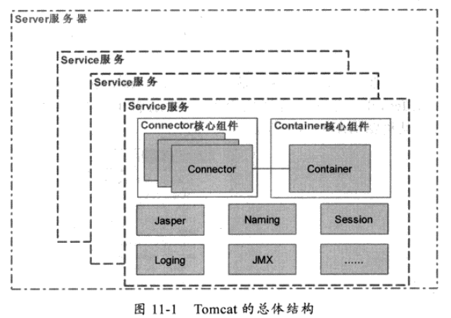

# Tomcat

## Servlet

1.  Java Servlet（Java服务器小程序）是一个基于Java技术的Web组件，运行在服务器端，它**由Servlet容器**所管理，用于生成动态的内容。 Servlet是平台独立的Java类，编写一个Servlet，实际上就是按照Servlet规范编写一个Java类。Servlet被编译为平台独立 的字节码，可以被动态地加载到支持Java技术的Web服务器中运行。

2. Servlet容器也叫做Servlet引擎，是Web服务器或应用程序服务器的一部分，用于在发送的请求和响应之上提供网络服务，解码基于 MIME的请求，格式化基于MIME的响应。**Servlet没有main方法，不能独立运行，它必须被部署到Servlet容器中**，由容器来实例化和调用 Servlet的方法（如doGet()和doPost()），Servlet容器在Servlet的生命周期内包容和管理Servlet。在JSP技术 推出后，管理和运行Servlet/JSP的容器也称为Web容器。

**（1）加载和实例化**

当Servlet容器启动或客户端发送一个请求时，Servlet容器会查找内存中是否存在该Servlet实例，若存在，则直接读取该实例响应请求；如果不存在，就创建一个Servlet实例。

**（2） 初始化**

实例化后，Servlet容器将调用Servlet的init()方法进行初始化（一些准备工作或资源预加载工作）。

**（3）服务**

初始化后，Servlet处于能响应请求的就绪状态。当接收到客户端请求时，调用service()的方法处理客户端请求，HttpServlet的service()方法会根据不同的请求 转调不同的doXXX()方法。

**（4）销毁**

当Servlet容器关闭时，Servlet实例也随时销毁。其间，Servlet容器会调用Servlet 的destroy()方法去判断该Servlet是否应当被释放（或回收资源）。

## Tomcat

1. Server：代表整个 servlet 容器（顶层容器）。

2. Service：它由一个或者多个Connector组成，以及一个Engine，负责处理所有Connector所获得的客户请求。

3. Connector：一个Connector将在某个指定的端口上监听客户请求，并且将获得的请求交给Engine来处理，从Engine获得回应并且返 回给客户。Tomcat有一个典型的Connector，一个直接监听来自browser的http请求，一个监听来自其他WebServer的请求。 比如8080端口和8009端口就是做这两个事。

4. Engine：Engine下可以配置多个虚拟主机Virtual Host，每个虚拟主机都有一个域名，当Engine获得一个请求时，它把该请求匹配到某个Host上，然后把该请求交给该Host来处理，Engine有一个默认虚拟主机，当请求无法匹配到任何一个Host上的时候，将交给该Host来处理。

5. Host：代表一个虚拟主机，每个虚拟主机和某个网络域名Domain Name相匹配，每个虚拟主机下可以部署一个或者多个WebApp，每个WebApp对应一个Context，每个Context都有一个Context Path，当Host获得一个请求时，将把该请求匹配到某个Context上，然后把该请求交给该Context来处理。

6. Context：一个Context 对应于一个Web Application，一个Web Application 由一个或者多个Servlet组成，Context在创建的时候将根据     配置文件 CATALINA_HOME/conf/web.xml和​WEBAPP_HOME/WEB-INF/web.xml载入Servlet类。

[tomcat的架构和原理](https://www.jianshu.com/p/d4a22c9588c6)

Tomcat启动server服务器对外提供Service服务，Container作为Service的核心组件（Container可以连接多个Connector构成Service），有了Service就可以对外提供服务。简单说就是，Service是Container和Connector的结婚证，并已Server服务器为居对外提供服务。

从上述知，Service对外提供Web应用服务，而Service核心组件Container的灵魂便是Servlet容器。而真正管理Servlet的是Context容器。
Context容器直接管理Servlet在容器中的包装类Wrapper，一个Web应用对应一个Context容器。添加一个Web应用就会创建一个Context容器，并将这个Context容器加入到父容器Host中。

