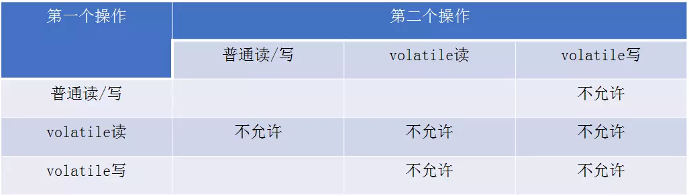
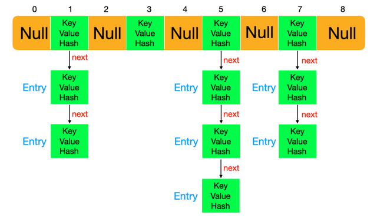

# java基础


## Java中Runnable和Thread以及Callable的区别

### 继承Thread

- 一个类只要继承了Thread类同时覆写了本类中的run()方法就可以实现多线程操作了，但是一个类只能继承一个父类。

### 实现Runnable接口

- 一个类可以实现多个接口
- 适合于资源的共享

### 实现Callable接口

- Callable使用call()方法，Runnable使用run()方法。
- call()可以返回值，run()不能返回。
- call()可以抛出受检查的异常。

```java
class TaskWithResult implements Callable<String> {  
    private int id;  

    public TaskWithResult(int id) {  
        this.id = id;  
    }  

    @Override  
    public String call() throws Exception {  
        return "result of TaskWithResult " + id;  
    }  
}  

public class CallableTest {  
    public static void main(String[] args) throws InterruptedException,  
            ExecutionException {  
        ExecutorService exec = Executors.newCachedThreadPool();  
       //Future 相当于是用来存放Executor执行的结果的一种容器  
        ArrayList<Future<String>> results = new ArrayList<Future<String>>();    
        for (int i = 0; i < 10; i++) {  
            results.add(exec.submit(new TaskWithResult(i)));  
        }  
        for (Future<String> fs : results) {  
            if (fs.isDone()) {  
                System.out.println(fs.get());  
            } else {  
                System.out.println("Future result is not yet complete");  
            }  
        }  
        exec.shutdown();  
    }  
} 
```

## Stream

### 操作符

操作符就是对数据进行的一种处理工作，一道加工程序；就好像工厂的工人对流水线上的产品进行一道加工程序一样。

### 中间操作符

- map(mapToInt,mapToLong,mapToDouble) 转换操作符，把比如A->B，这里默认提供了转int，long，double的操作符。
- flatmap(flatmapToInt,flatmapToLong,flatmapToDouble) 拍平操作比如把 int[]{2,3,4} 拍平 变成 2，3，4 也就是从原来的一个数据变成了3个数据，这里默认提供了拍平成int,long,double的操作符。
- limit 限流操作，比如数据流中有10个 我只要出前3个就可以使用。
- distint 去重操作，对重复元素去重，底层使用了equals方法。
- filter 过滤操作，把不想要的数据过滤。
- peek 挑出操作，如果想对数据进行某些操作，如：读取、编辑修改等。
- skip 跳过操作，跳过某些元素。
- sorted(unordered) 排序操作，对元素排序，前提是实现Comparable接口，当然也可以自定义比较器。

### 终止操作符

数据经过中间加工操作，就轮到终止操作符上场了；终止操作符就是用来对数据进行收集或者消费的，数据到了终止操作这里就不会向下流动了，终止操作符只能使用一次。

- collect 收集操作，将所有数据收集起来，这个操作非常重要，官方的提供的Collectors 提供了非常多收集器，可以说Stream 的核心在于Collectors。
- count 统计操作，统计最终的数据个数。
- findFirst、findAny 查找操作，查找第一个、查找任何一个 返回的类型为Optional。
- noneMatch、allMatch、anyMatch 匹配操作，数据流中是否存在符合条件的元素 返回值为bool 值。
- min、max 最值操作，需要自定义比较器，返回数据流中最大最小的值。
- reduce 规约操作，将整个数据流的值规约为一个值，count、min、max底层就是使用reduce。
- forEach、forEachOrdered 遍历操作，这里就是对最终的数据进行消费了。
- toArray 数组操作，将数据流的元素转换成数组。

## Java并发编程三个性质：原子性、可见性、有序性

- 原子性：一个操作或多个操作要么全部执行且执行过程不被中断，要么不执行
- 可见性：多个线程修改同一个共享变量时，一个线程修改后，其他线程能马上获得修改后的值
- 有序性 :  程序执行的顺序按照代码的先后顺序执行
- 可以通过 **synchronized**和**Lock**实现原子性，因为synchronized和Lock能够保证任一时刻**只有一个线程**访问该代码块；Java提供了**volatile关键字**保证可见性；synchronized和lock也可保证可见性，在加锁时其他线程无法访问共享资源；可以通过**volatile**关键字来保证一定的“有序性”

## Cookie和Session

**会话（Session）**跟踪是Web程序中常用的技术，用来**跟踪用户的整个会话**。常用的会话跟踪技术是Cookie与Session。**Cookie通过在客户端记录信息确定用户身份**，**Session通过在服务器端记录信息确定用户身份**。

### Cookie

一个用户请求操作都属于同一个会话，不同用户请求不属于不同会话。而Http协议是无状态协议。数据交互完毕后，客户端与服务端的连接就会关闭，再次交换数据需要建立新的连接。

- Cookie是一小段文本信息，如果服务器需要记录用户状态，使用response向客户端浏览器颁发一个Cookie，浏览器把Cookie存起来。当浏览器再次请求，浏览器把Cookie提交给服务器。
- Cookie具有不可跨域名性。
- 　Cookie是不可跨域名的。域名www.google.com颁发的Cookie不会被提交到域名www.baidu.com去。这是由Cookie的隐私安全机制决定的。需要设置Cookie的domain参数。
- 如果不设定时间，它的生命周期为浏览器会话的期间，只要关闭浏览器，cookie就消失了。
- 如果设置cookie的过期时间，浏览器会把cookie保存到硬盘中，再次打开浏览器有效。

### Session

Session是服务器端使用的一种记录客户端状态的机制

- Session在用户第一次访问服务器的时候自动创建。
- 设置Session有效期防止Session过多。
- Tomcat中Session默认失效时间为20分钟。
- 调用Session的invalidate方法。

## Java对象的大小

```java
Object ob = new Object();
```

在java中一个空Object对象的大小是8byte，那么它所占的空间为：4byte+8byte。4byte为Java栈中保存引用的所需要的空间。8byte为Java堆中对象的信息。Java非基本类型对象都默认继承Object对象，大小必须大于8byte。

```java
Class NewObject {
    int count;
    boolean flag;
    Object ob;
}
    //其大小为：空对象大小(8byte)+int大小(4byte)+Boolean大小(1byte)+空Object引用的大小(4byte)=17byte。但是因为Java在对对象内存分配时都是以8的整数倍来分，因此大于17byte的最接近8的整数倍的是24，因此此对象的大小为24byte。
```

- 包装类已经成为对象，至少12byte（声明Object最小空间），java对象是8的整数倍，因此一个基本类型包装类至少16byte。

  | **包装类型** | **缓存赋值范围** | **基本数据类型** | **二进制数** |
  | :----------- | ---------------- | ---------------- | ------------ |
  | Boolean      | 全部缓存         | boolean          | 1            |
  | Byte         | [-128, 127]      | byte             | 8            |
  | Character    | <=127            | char             | 16           |
  | Short        | [-128, 127]      | short            | 16           |
  | Integer      | [-128, 127]      | int              | 32           |
  | Long         | [-128, 127]      | long             | 64           |
  | Float        | 没有缓存         | float            | 32           |
  | Double       | 没有缓存         | double           | 64           |

  

## 引用类信息

- 强引用：一般声明对象是虚拟机生成的引用，强引用下，垃圾回收需要严格判断当前对象是否被强引用，如果被强引用，则不会被垃圾回收。
- 软引用：一般作为缓存使用。软引用在垃圾回收时，虚拟机根据当前系统剩余内存来决定是否堆软引用进行回收。**发生OutOfMemory时，肯定没有软引用存在。**
- 弱引用：弱引用与软引用类似，弱引用在进行垃圾回收时，是一定会被回收掉的。

## 线程与进程间的通信

### 线程间的通信

- 共享内存：

  - Volatile关键字，多个线程同时监听一个变量，当这个变量发生变化的时候，线程能够感知并执行相应的业务。
  - CountDownLatch基于AQS框架，相当于维护了一个线程共享变量state。
  - **ReentrantLock结合Condition**

- 消息传递：

  - wait()、notify()、notifyall()；

    >  wait和 notify必须配合synchronized使用，wait方法释放锁，notify方法不释放锁

### 进程间的通信

- 管道：在内核中申请一块固定大小的缓存区，程序拥有写入和读取的权力，实现进程间的通信。
  - 面向字节流
  - 生命周期随内核
  - 自带同步互斥机制
  - 半双工，单向通信，两个管道实现双向通信

- 消息队列：在内核中创建一队列，队列中每个元素是一个数据报，不同的进程可以通过句柄去访问这个队列。消息队列提供了一个从一个进程向另外一个经常发送一块数据的方法。
  - 同管道一样不足，每个消息的最大长度有限。
  - 消息队列可以认为是一个全局的一个链表，链表节点存放数据报类型和内容，有队列的标识符进行标记。
  - 消息队列允许一个或多个进程写入或者读取消息。
  - 消息队列的生命周期随内核。
  - 消息队列可实现双向通信。
- 信号量：在内核中创建一个信号量集合（本质是个数组），数组的元素（信号量）都是1，使用P操作进行-1，使用V操作+1。
  - P(sv)：如果sv的值⼤大于零，就给它减1；如果它的值为零，就挂起该进程的执⾏ 。
  - V(sv)：如果有其他进程因等待sv而被挂起，就让它恢复运⾏，如果没有进程因等待sv⽽挂起，就给它加1。
  - PV操作用于同一进程，实现互斥。
  - PV操作用于不同进程，实现同步。
- 共享内存： 将同一块物理内存一块映射到不同的进程的虚拟地址空间中，实现不同进程间对同一资源的共享。共享内存可以说是最有用的进程间通信方式，也是最快的IPC形式。
  - 不用从用户态到内核态的频繁切换和拷贝数据，直接从内存中读取就可以。
  - 共享内存是临界资源，所以需要操作时必须要保证原子性。使用信号量或者互斥锁都可以。
  - 生命周期随内核。

>  所有的以上的方式都是生命周期随内核，不手动释就不会消失。

## 内存模型

[JMM和底层实现原理](https://www.jianshu.com/p/8a58d8335270)

Java线程之间的通信由Java内存模型（Java Memory Model，简称JMM）控制。JMM决定一个线程对共享变量的写入何时对另一个线程可见。

Java的并发采用共享内存模型

### 现代计算机的内存模型

现代计算机中，cpu的指令速度远超内存的存取速度，所以现代计算机系统都不得不加入一层读写速度尽可能接近处理器运算速度的高速缓存（Cache）来作为内存与处理器之间的缓存；这种方式存在的问题是缓存一致性；


### Java内存模型（JMM）

JMM定义了Java虚拟机在计算机内存（RAM）中的工作方式，是隶属于JVM的。JMM定义了线程和主内存之间的抽象关系：线程之间的共享变量存储在主内存中，每个线程都有一个私有的本地内存，本地内存中存储了该线程以读/写共享变量的副本。本地内存是JMM的一个抽象概念，涵盖了缓存、写缓存、寄存器以及其他的硬件和编译器优化。


### JVM对Java内存模型的实现

- 在JVM内部，java内存模型把内存分成了两部分：线程和堆区；JVM中运行的每个线程都拥有自己的线程栈，线程栈包含了当前线程执行的方法调用相关信息，随着代码的不断执行，调用栈会不断变化。
- 所有原始类型(boolean,byte,short,char,int,long,float,double)的局部变量都直接保存在线程栈当中，对于它们的值各个线程之间都是独立的。对于原始类型的局部变量，一个线程可以传递一个副本给另一个线程，当它们之间是无法共享的。
- 堆区包含了Java应用创建的所有对象信息，不管对象是哪个线程创建的，其中的对象包括原始类型的封装类（如Byte、Integer、Long等等）。不管对象是属于一个成员变量还是方法中的局部变量，它都会被存储在堆区。
- （局部变量）**一个局部变量如果是原始类型，那么它会被完全存储到栈区。 一个局部变量也有可能是一个对象的引用，这种情况下，这个本地引用会被存储到栈中，但是对象本身仍然存储在堆区。**
   （全局变量）**对于一个对象的成员方法，这些方法中包含局部变量，仍需要存储在栈区，即使它们所属的对象在堆区。 对于一个对象的成员变量，不管它是原始类型还是包装类型，都会被存储到堆区。Static类型的变量以及类本身相关信息都会随着类本身存储在堆区。**


### Java内存模型中的重排序


- 编译器优化的重排序。编译器在不改变单线程程序语义的前提下，可以重新安排语句的执行顺序。
- 指令集并行的重排序。现代处理器采用指令级并行技术来将多条指令重叠执行。如果不存在数据依赖性，处理器可以改变语句对应机器指令的执行顺序。
- 内存系统的重排序。由于处理器使用缓存和读写缓冲区，使得加载和存储操作看上去可能在乱序执行。

### 重排序与依赖性

- 数据依赖性


- 控制依赖性

flag变量是个标记，用来标识变量a是否已被写入，在use方法中比变量i依赖if (flag)的判断，这里就叫控制依赖，如果发生了重排序，结果就不对了。


- as-if-serial

不管如何重排序，单线程程序的执行结构不能被改变。即编译器不会对存在依赖关系的操作做重排序（单线程）。

### 并发下重排


这里假设有两个线程A和B，A首先执行init ()方法，随后B线程接着执行use ()方法。线程B在执行操作4时，能否看到线程A在操作1对共享变量a的写入呢？答案是：不一定能看到。
 由于操作1和操作2没有数据依赖关系，编译器和处理器可以对这两个操作重排序；同样，操作3和操作4没有数据依赖关系，编译器和处理器也可以对这两个操作重排序。让我们先来看看，当操作1和操作2重排序时，可能会产生什么效果？操作1和操作2做了重排序。程序执行时，线程A首先写标记变量flag，随后线程B读这个变量。由于条件判断为真，线程B将读取变量a。此时，变量a还没有被线程A写入，这时就会发生错误！
 当操作3和操作4重排序时会产生什么效果？
 在程序中，操作3和操作4存在控制依赖关系。当代码中存在控制依赖性时，会影响指令序列执行的并行度。为此，编译器和处理器会采用猜测（Speculation）执行来克服控制相关性对并行度的影响。以处理器的猜测执行为例，执行线程B的处理器可以提前读取并计算a*a，然后把计算结果临时保存到一个名为重排序缓冲（Reorder Buffer，ROB）的硬件缓存中。当操作3的条件判断为真时，就把该计算结果写入变量i中。猜测执行实质上对操作3和4做了重排序，问题在于这时候，a的值还没被线程A赋值。在单线程程序中，对存在控制依赖的操作重排序，不会改变执行结果（这也是as-if-serial语义允许对存在控制依赖的操作做重排序的原因）；但在多线程程序中，对存在控制依赖的操作重排序，可能会改变程序的执行结果。

### 解决在并发下的问题

#### 内存屏障——禁止重排序

JMM把内存屏障指令分为4类，StoreLoad barriers是一个全能屏障，同时具有其他3个屏障的效果。现代的多处理器大多支持该屏障。


#### 临界区

临界区内的代码可以重排序，但JMM不允许临界区内的代码“逸出”到临界区之外。

#### Happens-Before

用happens-before的概念来阐述操作之间的内存可见性。在JMM中，如果一个操作执行的结果需要对另一个操作可见，那么两个操作之间必须要存在happens-before关系。

happens-before关系本质上和as-if-serial语义是一回事。as-if-serial语义保证单线程内程序的执行结果不被改变，happens-before关系保证正确同步的多线程程序的执行结果不被改变。


### 实现原理

#### volatile的内存语义

- 写内存语义：当写一个volatile变量时，JMM会把该线程对应的内存中的共享变量值刷新到主内存。
- 读内存语义：当读一个volatile变量时，JMM会把该线程的本地内存置为无效，线程接下来将从主内存中读取共享变量。

- JMM对volatile的内存屏障插入策略：

在每个volatile写操作的前面插入一个StoreStore屏障。在每个volatile写操作的后面插入一个StoreLoad屏障。
在每个volatile读操作的后面插入一个LoadLoad屏障。在每个volatile读操作的后面插入一个LoadStore屏障。

- 有volatile变量修饰的共享变量进行写操作的时候会使用CPU提供的Lock前缀指令：
  - 将当前处理器缓存行的数据写回到系统内存
  - 这个写回内存的操作会使在其他CPU里缓存了该内存地址的数据无效。

#### synchronized的实现原理

使用monitorenter和monitorexit指令实现的。

- 每个对象有一个监视器锁（monitor）。当monitor被占用时就会处于锁定状态，线程执行monitorenter指令时尝试获取monitor的所有权，过程如下：
  - 如果monitor的进入数为0，则该线程进入monitor，然后将进入数设置为1，该线程即为monitor的所有者。
  - 如果线程已经占有该monitor，只是重新进入，则进入monitor的进入数加1.
  - 如果其他线程已经占用了monitor，则该线程进入阻塞状态，直到monitor的进入数为0，再重新尝试获取monitor的所有权。
- monitorexit
  - 执行monitorexit的线程必须是objectref所对应的monitor的所有者。
  - 指令执行时，monitor的进入数减1，如果减1后进入数为0，那线程退出monitor，不再是这个monitor的所有者。其他被这个monitor阻塞的线程可以尝试去获取这个 monitor 的所有权。 
  - 通过这两段描述，我们应该能很清楚的看出Synchronized的实现原理，Synchronized的语义底层是通过一个monitor的对象来完成，其实wait/notify等方法也依赖于monitor对象，这就是为什么只有在同步的块或者方法中才能调用wait/notify等方法，否则会抛出java.lang.IllegalMonitorStateException的异常的原因。

> 1. 修饰方法，对同一个对象在两个线程中分别访问该对象的两个同步实例方法**会产生排斥**
> 2. 修饰方法，不同对象在两个线程中分别调用同一个同步实例方法**不会互斥**
> 3. 修饰静态方法，实际对该类对象加锁，即“类锁”，**会产生互斥**。
> 4. 一个对象在两个线程中分别调用一个同步静态方法和一个同步实例方法，**不会产生互斥**。静态实际上对类对象调用，调用实例方法是对实例对象调用。不是一个对象锁。
> 5. 静态方法加锁，能和该类中所有用synchronized修饰静态方法的相互互斥，和未用synchronized修饰的静态方法不互斥。
> 6. 锁代码块，在使用完同步的地方后释放锁，提升速度。

#### final的内存语义

- 在构造函数内对一个final域的写入，与随后把这个被构造对象的引用赋值给一个引用变量，这两个操作之间不能重排序。
- 初次读一个包含final域的对象的引用，与随后初次读这个final域，这两个操作之间不能重排序。
- 在构造函数内对一个final引用的对象的成员域的写入，与随后在构造函数外把这个被构造对象的引用赋值给一个引用变量，这两个操作之间不能重排序。
- 会要求编译器在final域的写之后，构造函数return之前插入一个StoreStore障屏。
- 读final域的重排序规则要求编译器在读final域的操作前面插入一个LoadLoad屏障

## ArrayList

- 默认大小10
- 扩容1.5倍

### 增

#### add()

`add(E object)`这个方法，是直接添加一个元素，是在尾部进行插入。

如果原数组的大小不够会先进行扩容。

最终将数据添加在尾部，同时大小加1.

####  add(int index, E object) 在指定位置添加一个元素

1. 如果数组够用，即 `s<a.length`时，直接调用`arraycopy()`，将从index开始的所有数据都往后挪一位。

2. 如果数组满了，即`s>=a.length`时，这里就要

   a. 先将原数组进行扩容，生成新的数组；

   b. 将原数组中index之前的数据复制到新数组对应的位置中去。

   c. 将原数组中index之后的数据往后挪一位的移动到新的数组中去。

   d. 将新数组赋给array。

### 删除

#### remove(int index)删除指定位置元素

把删除元素的后边数据全部前移一位

```java
public E remove(int index) {
        rangeCheck(index);

        modCount++;
        E oldValue = elementData(index);

        int numMoved = size - index - 1;
        if (numMoved > 0)
            System.arraycopy(elementData, index+1, elementData, index,
                             numMoved);
        elementData[--size] = null; // clear to let GC do its work

        return oldValue;
    }
```

#### remove(Object object) 删除某个已知元素

从前往后遍历，找到第一个equals删除，如果是类需要重写equals，

```java
public boolean remove(Object o) {
        if (o == null) {
            for (int index = 0; index < size; index++)
                if (elementData[index] == null) {
                    fastRemove(index);
                    return true;
                }
        } else {
            for (int index = 0; index < size; index++)
                if (o.equals(elementData[index])) {
                    fastRemove(index);
                    return true;
                }
        }
        return false;
    }
```

**遍历删除的时候，需要从后往前删除，否则会删除不干净，因为删除一个元素，后边的元素会向前移动。**

### 改、查

- 查直接返回数据相应索引的数据。

- 改会返回旧值。

  ```java
  public E set(int index, E element) {
      rangeCheck(index);
  
      E oldValue = elementData(index);
      elementData[index] = element;
      return oldValue;
  }
  ```

### 遍历

遍历ArrayList有3种方式：

- 一种是普通for循环的方式。

- 一种是增强for循环的方式。

- 还有一种是迭代器的方式。

  ```java
  Iterator<String> iterator = arrayList.iterator();
  while (iterator.hasNext()) {
      System.out.print(iterator.next());
  }
  ```

## HashMap

### HashMap和HashTable区别

**相同点：**

HashMap和HashTable都是基于哈希表实现，每个元素都是key-value键值对，HashMap和HashTable都实现了Map、Cloneable、Serializable接口。

**不同点：**

- 父类不同：HashMap继承了AbstractMap类，而HashTable继承了Dictionary类。
- 空值不同：HashMap允许空的key和value值，HashTable和ConcurrentHashMap不允许空的key和value值。（一部分说是规范；二是并发对象会改变，无法确认是null类型还是没有这个元素）
- 线程安全：HashMap不是线程安全的，HashTable和ConcurrentHashMap是安全的。
- HashMap进行put或get，可以达到常数时间，HashTable的put和get加了synchronized锁，效率差。
- 初始容量不同：HashTable初始11，扩容为之前的2n+1，HashMap初始为16，扩容2倍。如果给定大小，HashMap会扩充到2的幂次方大小。

### HashMap和HashSet的区别

HashSet继承于AbstractSet接口，实现了Set、Cloneable、java.io.Serializable接口。HashSet不会出现重复值。HashSet底层其实就是HashMap，对HashSet的操作就是对HashMap的操作。

### HashMap底层结构


### AbstractMap类

Map接口的骨干实现，最大化的减少实现类的工作量。为了实现不可修改的 map，程序员仅需要继承这个类并且提供 entrySet 方法的实现即可。它将会返回一组 map 映射的某一段。通常，返回的集合将在AbstractSet 之上实现。这个set不应该支持 add 或者 remove 方法，并且它的迭代器也不支持 remove 方法。

为了实现可修改的 map，程序员必须额外重写这个类的 put 方法(否则就会抛出UnsupportedOperationException)，并且 entrySet.iterator() 返回的 iterator 必须实现 remove() 方法。

### Map接口

Map 接口定义了 key-value 键值对的标准。一个对象支持 key-value 存储。Map不能包含重复的 key，每个键最多映射一个值。这个接口代替了Dictionary 类，Dictionary是一个抽象类而不是接口。

Map 接口提供了三个集合的构造器，它允许将 map 的内容视为一组键，值集合或一组键值映射。map的顺序定义为map映射集合上的迭代器返回其元素的顺序。一些map实现，像是TreeMap类，保证了map的有序性；其他的实现，像是HashMap，则没有保证。

### 重要内部类和接口

#### Node接口

Node节点用来存储HashMap的一个个实例，实现了Map.Entry接口；Node<K,V>[ ] tab就是数组，tab所存储元素为每个链表的第一个元素。

每个数组的位置就是一个哈希值，如果两个值哈希值一样，就会占用一个位置，他们就成了一个链表。

```java
 static class Node<K,V> implements Map.Entry<K,V> {
        final int hash;
        final K key;
        V value;
        Node<K,V> next;
        
        ...
}
```

#### Map.Entry

一个map的entry链，Map.Entry是Map声明的一个内部接口，此接口为泛型，定义为Entry<K,V>。它表示Map中的一个实体（一个key-value对）。接口中有getKey(),getValue方法。

```java
 Map<String, String> map = new HashMap<String, String>();    
  map.put("key1", "value1");    
  map.put("key2", "value2");    
  map.put("key3", "value3");    
      
  //第一种：普遍使用，二次取值    
  System.out.println("通过Map.keySet遍历key和value：");    
  for (String key : map.keySet()) {    
   System.out.println("key= "+ key + " and value= " + map.get(key));    
  }    
      
  //第二种    
  System.out.println("通过Map.entrySet使用iterator遍历key和value：");    
  Iterator<Map.Entry<String, String>> it = map.entrySet().iterator();    
  while (it.hasNext()) {    
   Map.Entry<String, String> entry = it.next();    
   System.out.println("key= " + entry.getKey() + " and value= " + entry.getValue());    
  }    
      
 //第三种：推荐，尤其是容量大时</span>    
  System.out.println("通过Map.entrySet遍历key和value");    
  for (Map.Entry<String, String> entry : map.entrySet()) {    
   System.out.println("key= " + entry.getKey() + " and value= " + entry.getValue());    
  }    
    
  //第四种    
  System.out.println("通过Map.values()遍历所有的value，但不能遍历key");    
  for (String v : map.values()) {    
   System.out.println("value= " + v);    
  }
```


### HashMap 1.7底层结构

JDK1.7中，HashMap采用位桶+链表的实现，HashMap底层数据接口就是一个Entry数组，Entry是HashMap的基本组成单元，每个Entry包含了一个key-value键值对。

每个Entry中包含[hash，key，value]属性，它是HashMap的一个内部类。



### HashMap 1.8底层结构

1.8底层结构做了一些改变，当每个桶中元素大于8时，会转变为红黑树优化查询效率，重写了resize() 方法。

### HashMap属性

- HashMap默认容量16.

- HashMap最大容量1<<30（int四个字节，最大左移31，最高位是符号为，最大左移30）。
- 默认负载因子0.75f。
- 树化阈值：一个桶中存储元素大于8并且数组长度大于等于64会转化为红黑树。
- 链表阈值：一个桶中存储元素数量<6后，会转化为链表。
- 节点数组：HashMap中节点数组是Entry数组`transient Node<K,V>[] table`，Node数组在第一次使用的时候进行初始化操作，在必要的时候进行resize，resize后数组长度扩容为原来的二倍。

### put()

大致过程如下，首先会使用 hash 方法计算对象的哈希码，根据哈希码来确定在 bucket 中存放的位置，如果 bucket 中没有 Node 节点则直接进行 put，如果对应 bucket 已经有 Node 节点，会对链表长度进行分析，判断长度是否大于 8，如果链表长度小于 8 ，在 JDK1.7 前会使用头插法，在 JDK1.8 之后更改为尾插法。如果链表长度大于 8 会进行树化操作，把链表转换为红黑树，在红黑树上进行存储。

## [ThreadLocal与内存泄漏](https://zhuanlan.zhihu.com/p/58636499)

## 反射的缺点

- 第一个是性能问题。用于字段和方法接入时反射要远慢于直接代码。性能问题的程度取决于程序中是如何使用反射的。如果它作为程序运行中相 对很少涉及的部分，缓慢的性能将不会是一个问题。即使测试中最坏情况下的计时图显示的反射操作只耗用几微秒。仅反射在性能关键的应用的核心逻辑中使用时性 能问题才变得至关重要。

- 许多应用中更严重的一个缺点是使用反射会模糊程序内部实际要发生的事情。程序人员希望在源代码中看到程序的逻辑，反射等绕过了源代码的技术会带来维护问 题。反射代码比相应的直接代码更复杂，正如性能比较的代码实例中看到的一样。解决这些问题的最佳方案是保守地使用反射——仅在它可以真正增加灵活性的地方 ——记录其在目标类中的使用。
- 安全限制：使用反射技术要求程序必须在一个没有安全限制的环境中运行。如果一个程序必须在有安全限制的环境中运行，如 Applet，那么这就是个问题了。
- 内部暴露：由于反射允许代码执行一些在正常情况下不被允许的操作（比如访问私有的属性和方法），所以使用反射可能会导致意料之外的副作用 - 代码有功能上的错误，降低可移植性。反射代码破坏了抽象性，因此当平台发生改变的时候，代码的行为就有可能也随着变化。

