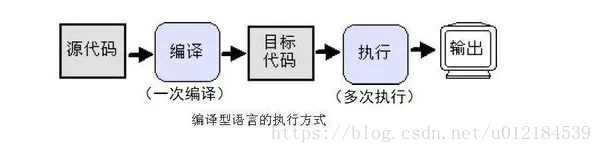
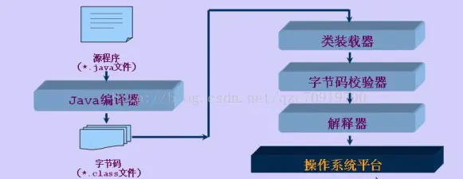
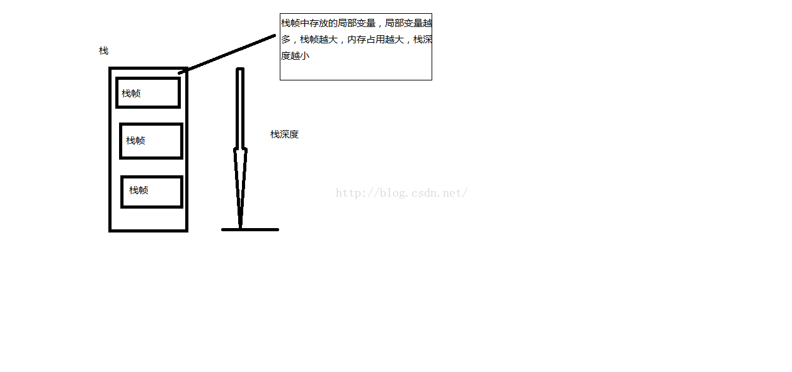
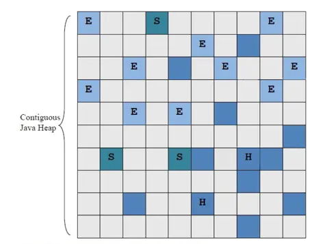
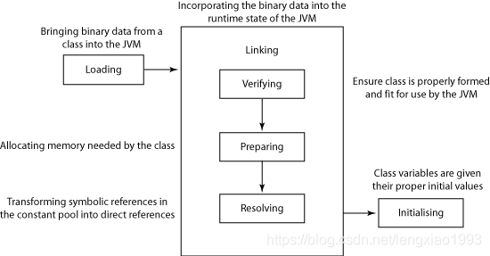

# JVM

[调优总结](https://www.cnblogs.com/andy-zhou/p/5327288.html)

## JDK是什么

- JDK 是用于支持 Java 程序开发的最小环境。

- 是功能齐全的JavaSDK，拥有JRE所拥有的一切，还有编译器（javac）和工具。能够创建和编译程序。

## JRE是什么

- JRE是Java运行时环境。
- 运行已编译Java程序所需要的所有内容的集合。
- 包括JVM，Java类库，Java命令和其他的一些基础构建。
- 不能创建新程序。

## JVM

- JVM是运行Java字节码的虚拟机。
- JVM有针对不同系统的实现，使得使用相同字节码，都会给出相同的结果。

## 字节码

- JVM可以理解的代码叫字节码（.class文件），只面向虚拟机。

## 编译型语言

- 执行之前，需要编译过程，把源码编译成机器语言的文件。

- 以后运行不需要编译，执行效率高。

  

## 解释型语言

- 使用专门解释器对源程序逐行解释成特定平台的机器码并立即执行。

- 在执行时才被解释器一行行动态翻译和执行。

- 不需要事先编译，需要解释器。

- 每次将源代码解释成机器码并执行，效率低。

- Java需要编译，但编译后不能直接运行。

  

## 永久代(Perm)和元空间

- 字符串存在永久代中，容易出现性能问题和内存溢出。
- 类及方法的信息等比较难确定其大小，因此对于永久代的大小指定比较困难，太小容易出现永久代溢出，太大则容易导致老年代溢出。
- 永久代会为 GC 带来不必要的复杂度，并且回收效率偏低。

## 常量池

- 在 jdk1.6（含）之前**运行时常量池逻辑包含字符串常量池**存放在方法区, 此时**hotspot**虚拟机对方法区的实现为**永久代**
- 常量池在 jdk1.7（含）之后字符串常量池被从**方法区拿到了堆**中, 这里没有提到运行时常量池,也就是说字符串常量池被单独拿到堆,**运行时常量池剩下的东西还在方法区**, 也就是hotspot中的永久代 
- jdk1.8 移除了**永久代**用**元空间(Metaspace)**取而代之, 字符串常量池和运行时常量池逻辑上属于方法区，但是实际存放在堆内存中，因此既可以说两者存放在堆中，也可以说两则存在于方法区中，这就是造成误解的地方。

## 方法区

- 存放已被加载的类信息、常量、静态变量、即时编译器编译后的代码数据。
- 即永久代，在jdk1.8中不存在方法区了，被元数据区替代了，原方法区被分成两部分；1：加载的类信息，2：运行时常量池；
- 加载的类信息被保存在元数据区中，运行时常量池保存在堆中；

## JVM内存溢出

在java语言里， 当你创建一个线程的时候，虚拟机会在JVM内存创建一个Thread对象同时创建一个操作系统线程，而这个系统线程的内存用的不是JVMMemory，而是系统中剩下的内存(MaxProcessMemory - JVMMemory - ReservedOsMemory)。

***你给JVM内存越多，那么你能创建的线程越少，越容易发生java.lang.OutOfMemoryError: unable to create new native thread。***



局部变量表内容越多，栈帧越大，栈深度越小。

## JVM调优总结

### 数据类型

- 基本类型：byte,short,int,long,char,float,double,Boolean,returnAddress
- 引用类型：类类型，接口类型和引用类型（数组）。

### 栈与堆

栈解决程序的运行问题，即程序如何执行，或者说如何处理数据；堆解决的是数据存储的问题，即数据怎么放、放在哪儿。

- 栈：
  - java中一个线程对应一个线程栈，栈是运行单位，里边存储的信息都与当前线程对应，包括局部变量表、程序运行状态、方法返回值等。
  - Main函数是栈的起始点，也是程序的起始点。
  - 栈中存的是**基本数据类型和堆中对象引用**。因为基本类型不会出现动态增长的情况，长度固定。

- 堆：
  - 所有线程共享，只存储对象信息。

### 总结

- 年轻代大小选择：
  - 响应时间优先的应用：尽可能大，直到接近系统的最低响应时间限制。年轻代收集发生的频率是最小的。减少到达年老代的对象。
  - 吞吐量优先的应用：尽可能的设置大，可能到达Gbit的程度。堆响应时间没要求，垃圾收集可以并行进行。
  
- 年老代大小选择：
  - 响应时间优先的应用：年老代使用并发收集器，如果堆设置小了，可以灰照成内存碎片、高回收频率以及应用暂停而使用传统的标记清楚方式；如果对设置大了，需要较长的收集时间。需要考虑：
    - 并发垃圾收集信息
    - 持久代并发收集次数
    - 传统GC信息
    - 花在年轻代和年老代回收上的时间比例减少年轻代和年老代花费的时间，一般会提高应用的效率。
  
- 吞吐量优先的应用：一般吞吐量优先的应用都有一个很大的年轻代和一个较小的老年代。这样可以尽可能回收掉大部分短期对象，减少中期的对象，而年老代存放长期存活对象。

- 较小堆引起的碎片问题：因为老年代的并发收集器使用标记、清除算法，所以不会对堆进行压缩。当收集器回收时，他会把相邻的空间进行合并，这样可以分配较大的对象。当堆空间较小时，会出现碎片，如果并发收集器找不到足够空间，会停止并使用传统的标记、清除方式回收。如果出现碎片，可能需要如下配置：
  - -XX:+UseCMSCompactAtFullCollection：使用并发收集器时，开启对年老代的压缩。
  - -XX:CMSFullGCsBeforeCompaction=0：上面配置开启的情况下，这里设置多少次Full GC后，对年老代进行压缩
  
- full gc频繁说明old区很快满了。

  - 如果是一次fullgc后，剩余对象不多。那么说明你eden区设置太小，导致短生命周期的对象进入了old区。

  - 如果一次fullgc后，old区回收率不大，那么说明old区太小。

- Java整个堆大小设置，Xmx 和 Xms设置为老年代存活对象的3-4倍，即FullGC之后的老年代内存占用的3-4倍

  - 永久代 PermSize和MaxPermSize设置为老年代存活对象的1.2-1.5倍。
  - 年轻代Xmn的设置为老年代存活对象的1-1.5倍。
  - 老年代的内存大小设置为老年代存活对象的2-3倍。

## Java参数传递（值传递）

- Java没有指针，所以都是进行传值调用。
- 程序运行永远都是在栈中进行的，因而参数传递时，只存在传递基本类型和对象引用的问题。不会直接传对象本身。
- 在运行栈中，基本类型和引用的处理是一样的，都是传值，所以，如果是传引用的方法调用，也同时可以理解为“传引用值”的传值调用，即引用的处理跟基本类型是完全一样的。但是当进入被调用方法时，被传递的这个引用的值，被程序解释（或者查找）到堆中的对象，这个时候才对应到真正的对象。如果此时进行修改，修改的是引用对应的对象，而不是引用本身，即：修改的是堆中的数据。所以这个修改是可以保持的了。

## 如何区分垃圾

获取哪线对象正在被使用，需要从Java栈开始。一个栈是与一个线程对应，如果有多个线程，需要对这些对应的所有的栈进行检查。


还有系统运行时的寄存器，也是存储程序运行数据的。所以以栈或寄存器中的引用为起点，可以找到栈中的对象，这种引用逐步扩展，形成了一颗以Java栈中引用所对应的对象为根节点的一颗对象树，如果栈中有多个引用，则最终会形成多颗对象树。在这些对象树上的对象，都是当前系统运行所需要的对象，不能被垃圾回收。而其他剩余对象，则可以视为无法被引用到的对象，可以被当做垃圾进行回收。

- 垃圾回收的起点是一些根对象（java栈，静态变量，寄存器）。这种回收方式，是“标记-清除”。

## 什么情况下触发垃圾回收

### Young GC

一般情况下，当新对象生成，并且在Eden申请空间失败时，就会触发Scavenge GC，对Eden区域进行GC，清除非存活对象，并且把尚且存活的对象移动到Survivor区。然后整理Survivor的两个区。这种方式的GC是对年轻代的Eden区进行，不会影响到年老代。因为大部分对象都是从Eden区开始的，同时Eden区不会分配的很大，所以Eden区的GC会频繁进行。因而，一般在这里需要使用速度快、效率高的算法，使Eden去能尽快空闲出来。

### Full GC

对整个堆进行整理，包括Young、Tenured和Perm。Full GC因为需要对整个对进行回收，所以比Scavenge GC要慢，因此应该尽可能减少Full GC的次数。在对JVM调优的过程中，很大一部分工作就是对于FullGC的调节。有如下原因可能导致Full GC：

> - 年老代（Tenured）被写满 ·
> - 持久代（Perm）被写满  · System.gc()被显示调用  
> - 上一次GC之后Heap的各域分配策略动态变化

### Major GC

清理老年代


### JVM中一次完整的GC，对象如何晋升到老年代

- java堆 = 新生代+老年代；
- 新生代 = Eden + Suivivor（S0 + S1），默认分配比例是8:1:1;
- 当Eden区空间满了的时候，就会触发一次Minor GC，以收集新生代的垃圾，存活下来的对象会被分配到Survivor区
- 大对象（需要大量连续内存空间的对象）会直接被分配到老年代
- 如果对象在Eden中出生，并且在经历过一次Minor GC之后仍然存活，被分配到存活区的话，年龄+1，此后每经历过一次Minor GC并且存活下来，年龄就+1，当年龄达到15的时候，会被晋升到老年代；
- 当老年代满了，而无法容纳更多对象的话，会触发一次full gc；full gc存储的是整个内存堆（包括年轻代和老年代）；
- Major GC是发生在老年代的GC，清理老年区，经常会伴随至少一次minor gc；

### 垃圾回收算法

java中有四种垃圾回收算法，分别是标记清除法、标记整理法、复制算法、分代收集算法；

- 标记清除法：
  - 第一步：利用可达性去遍历内存，把存活对象和垃圾对象进行标记；
  -  第二步：在遍历一遍，将所有标记的对象回收掉；
  - 特点：效率不行，标记和清除的效率都不高；标记和清除后会产生大量的不连续的空间分片，可能会导致之后程序运行的时候需分配大对象而找不到连续分片而不得不触发一次GC；

- 标记整理法：
  - 第一步：利用可达性去遍历内存，把存活对象和垃圾对象进行标记；
  - 第二步：将所有的存活的对象向一段移动，将端边界以外的对象都回收掉；
  - 特点：适用于存活对象多，垃圾少的情况；需要整理的过程，无空间碎片产生；

- 复制算法：
  - 将内存按照容量大小分为大小相等的两块，每次只使用一块，当一块使用完了，就将还存活的对象移到另一块上，然后在把使用过的内存空间移除；
  - 特点：不会产生空间碎片；内存使用率极低；

- 分代收集算法：

  根据内存对象的存活周期不同，将内存划分成几块，java虚拟机一般将内存分成新生代和老生代，在新生代中，有大量对象死去和少量对象存活，所以采用复制算法，只需要付出少量存活对象的复制成本就可以完成收集；老年代中因为对象的存活率极高，没有额外的空间对他进行分配担保，所以采用标记清理或者标记整理算法进行回收；

标记整理算法要在内存中移动对象，这很慢很低效，并且，在移动时，你还要考虑到并发问题（假如用户线程正在使用你移动的对象怎么办），所以你需要STW，那么此时又更慢了。

## 堆大小设置

JVM堆大小限制：1. 操作系统（32bit、64bit）2.系统可用虚拟内存限制 3.系统可用物理内存限制。

```java
java -Xmx3550m -Xms3550m -Xmn2g –Xss128k

-Xmx3550m：设置JVM最大可用内存为3550M。

-Xms3550m：设置JVM初始内存为3550m。此值可以设置与-Xmx相同，以避免每次垃圾回收完成后JVM重新分配内存。

-Xmn2g：设置年轻代大小为2G。整个堆大小=年轻代大小 + 年老代大小 + 持久代大小。持久代一般固定大小为64m，所以增大年轻代后，将会减小年老代大小。此值对系统性能影响较大，Sun官方推荐配置为整个堆的3/8。

-Xss128k：设置每个线程的堆栈大小。JDK5.0以后每个线程堆栈大小为1M，以前每个线程堆栈大小为256K。更具应用的线程所需内存大小进行调整。在相同物理内存下，减小这个值能生成更多的线程。但是操作系统对一个进程内的线程数还是有限制的，不能无限生成，经验值在3000~5000左右。
```

其他设置参数：

```java
-Xms:初始堆大小
-Xmx:最大堆大小
-Xmn:设置新生代大小（对 -XX:newSize、-XX:MaxnewSize两个参数的同时配置）
    
-XX:NewSize=n:设置年轻代大小
-XX:MaxnewSize：表示新生代可被分配的内存的最大上限；当然这个值应该小于-Xmx的值；

-XX:NewRatio=n:设置年轻代和年老代的比值。如:为3，表示年轻代与年老代比值为1：3，年轻代占整个年轻代年老代和的1/4
-XX:SurvivorRatio=n:年轻代中Eden区与两个Survivor区的比值。注意Survivor区有两个。如：3，表示Eden：Survivor=3：2，一个Survivor区占整个年轻代的1/5
    
-XX:PermSize：表示非堆区初始内存分配大小（方法区）
-XX:MaxPermSize：表示对非堆区分配的内存的最大上限（方法区）。
-XX:MaxPermSize=n:设置持久代大小
```

## 垃圾回收器的瓶颈

传统分代垃圾回收方式，已经在一定程度上把垃圾回收给应用带来的负担降到了最小，把应用的吞吐量推到了一个极限。但是他无法解决的一个问题，就是Full GC所带来的应用暂停。在一些对实时性要求很高的应用场景下，GC暂停所带来的请求堆积和请求失败是无法接受的。这类应用可能要求请求的返回时间在几百甚至几十毫秒以内，**如果分代垃圾回收方式要达到这个指标，只能把最大堆的设置限制在一个相对较小范围内**，但是这样有限制了应用本身的处理能力，同样也是不可接收的。

分代垃圾回收方式确实也考虑了实时性要求而提供了并发回收器，支持最大暂停时间的设置，但是受限于分代垃圾回收的内存划分模型，其效果也不是很理想。

## G1垃圾回收器

> 支持很大的堆
>
> 高吞吐量  
>
> ​	--支持多CPU和垃圾回收线程  
>
> ​	--在主线程暂停的情况下，使用并行收集 
>
> ​	 --在主线程运行的情况下，使用并发收集
>
> 实时目标：可配置在N毫秒内最多只占用M毫秒的时间进行垃圾回收

### G1结构

[参考](https://www.jianshu.com/p/aef0f4765098)

G1垃圾回收器建立在Region基础上，它要么是young，要么是old，还有一类特殊的Humongous（一个对象大小超过了某阈值-hotSpot中是Region的1/2，这种对象通常被称为大对象，会直接分配到老年代）。G1中同类型region不一定相邻，但在逻辑上，分代依旧连续：



<!--E代表Eden，S代表SUrvivor，H代表Humongous，剩余深蓝色代表的是Old，灰色代表的是空闲的region-->

每个分配的Region都可以分成两个部分，已分配和未分配的。它们的界限称为top。分配对象时，增加top的值，称为bump-the-pointer。


Region是G1回收器一次回收的最小单元。每次回收都是N个Region。N和G1回收的效率和用户设置的软实时目标有关。G1选择垃圾可能最多的Region进行回收。G1回收器会维护一个空间Region的链表，每次回收后Region的会被加入到这个链表中。

每次只有一个Region处于被分配的状态中，称为current region。这回带来并发问题，G1采用和CAS一样的TLABs。过程如下：

> 为线程分配Buffer的过程大概是：
>
> 1. 记录top值；
> 2. 准备分配；
> 3. 比较记录的top值和现在的top值，如果一样，则执行分配，并且更新top的值；否则，重复1；

这种方式会带来碎片。当一个线程在自己的Buffer里面分配的时候，虽然Buffer里面还有剩余的空间，但是却因为分配的对象过大以至于这些空闲空间无法容纳，此时线程只能去申请新的Buffer，而原来的Buffer中的空闲空间就被浪费了。Buffer的大小和线程数量都会影响这些碎片的多寡。

## 类加载

虚拟机把描述类的数据加载到内存里面，并对数据进行校验、解析和初始化，最终变成可以被虚拟机直接使用的class对象；

- 装载 （Loading）
  - 该阶段负责找到待加载类的二进制 class 文件， 并把它以 bytecode 的形式装载到虚拟机。 在这个过程中， JVM 会给这个类分配一个基本的内存结构， 但是方法， 变量域， 和它引用到的其他类在这个阶段都还没有处理， 也就是说， 这个类在目前阶段还不可用
- 链接 （Linking）
  - 这个步骤又可细分为3个阶段
  - 字节码验证
    - 验证字节码是否是一个正确，符合规范的类字节码
  - 类准备
    - 为这个类定义好必须的数据结构以表示成员变量域， 方法， 以及实现的接口等等
  - 解析
    - 把这个类所引用的其他类全部加载进来, 引用的方式有如下几种：
      - 继承
      - 实现接口
      - 域变量
      - 方法定义
      - 方法中定义的本地变量
- 初始化（Initializing）
  - 执行类中定义的静态代码块， 初始化静态变量为默认值



### 显式类加载与隐式类加载

从上文类加载的详细过程可以看出， 类有两种方式被加载进来

- 显式加载
  - 程序主动调用下列类型的方法去主动加载一个类
    - classloader.loadClass( className)
    - Class.forName( className)
- 隐式加载
  - 被显式加载的类对其他类可能存在如下引用：
    - 继承
    - 实现接口
    - 域变量    
    - 方法定义
    - 方法中定义的本地变量
  - 被引用的类会被动地一并加载至虚拟机， 这种加载方式属于隐式加载

## 类加载器

通过一个类的全限定性类名获取该类的二进制字节流。

- 启动类加载器（BootStrapClassLoader）：用来加载java核心类库，无法被java程序直接引用， 例如 `ArrayList`.
- 扩展类加载器（ExtClassLoader）：用来加载java的扩展库，java的虚拟机实现会提供一个拓展库目录，该类加载器在拓展库目录里面查找并加载java类。 通常是搜索 `$JAVA_HOME/lib/ext` 中的文件或是任意定义在 `java.ext.dirs` 属性中的文件夹下的文件予以加载
- 应用程序类加载器（AppClassLoader）：它根据java的类路径来加载类，java应用的类都是通过它来加载的。负责加载 `classpath` 下的文件
- 自定义类加载器：由java语言实现，继承自ClassLoader。

### 双亲委派模型

[类加载机制](https://blog.csdn.net/lengxiao1993/article/details/86689331)

当一个类加载器收到一个类加载的请求，他首先不会尝试自己去加载，而是将这个请求委派给父类加载器去加载，只有父类加载器在自己的搜索范围类查找不到给类时，子加载器才会尝试自己去加载该类；

```java
public Class<?> loadClass(String name) throws ClassNotFoundException {
     return loadClass(name, false);
}
  
protected Class<?> loadClass(String name, boolean resolve)
            throws ClassNotFoundException
        {
            synchronized (getClassLoadingLock(name)) {
                // First, check if the class has already been loadCed
                Class<?> c = findLoadedClass(name);
                if (c == null) {
                    long t0 = System.nanoTime();
                    try {
                        if (parent != null) {
                            c = parent.loadClass(name, false);
                        } else {
                            c = findBootstrapClassOrNull(name);
                        }
                    } catch (ClassNotFoundException e) {
                        // ClassNotFoundException thrown if class not found
                        // from the non-null parent class loader
                    }
    
                    if (c == null) {
                        // If still not found, then invoke findClass in order
                        // to find the class.
                        long t1 = System.nanoTime();
                        c = findClass(name);
    
                        // this is the defining class loader; record the stats
                        sun.misc.PerfCounter.getParentDelegationTime().addTime(t1 - t0);
                        sun.misc.PerfCounter.getFindClassTime().addElapsedTimeFrom(t1);
                        sun.misc.PerfCounter.getFindClasses().increment();
                    }
                }
                if (resolve) {
                    resolveClass(c);
                }
                return c;
            }
        }
```


### 双亲委派模型的原因

- 采用双亲委派模式的是好处是Java类随着它的类加载器一起具备了一种带有优先级的层次关系，通过这种层级关可以避免类的重复加载，当父亲已经加载了该类时，就没有必要子ClassLoader再加载一次。
- 其次是考虑到安全因素，java核心api中定义类型不会被随意替换，假设通过网络传递一个名为java.lang.Integer的类，通过双亲委托模式传递到启动类加载器，而启动类加载器在核心Java，API发现这个名字的类，发现该类已被加载，并不会重新加载网络传递的过来的java.lang.Integer，而直接返回已加载过的Integer.class，这样便可以防止核心API库被随意篡改。

### 打破双亲委派模型

- 自定义类加载器，继承ClassLoader类，重写loadClass方法和findClass方法；

  - findClass（）用于写类加载逻辑、loadClass（）方法的逻辑里如果父类加载器加载失败则会调用自己的findClass（）方法完成加载，保证了双亲委派规则。

  - 如果不想打破双亲委派模型，那么只需要重写findClass方法即可

  - 如果想打破双亲委派模型，那么就重写整个loadClass方法

- Tomcat 需要有能力同时运行多个 war 包， 而每个 war 包中都拥有各自的依赖 lib 库(`WEB-INF/lib`) 以及各自的项目代码(`WEB-INF/classes`)， 为了保证每个 web 项目可以共同运行， 互不干扰， Tomcat 为每个项目都创建一个单独 webapp classloader, 它会负责加载对应的 web 项目下 `WEB-INF/classes` 的 class 文件和资源以及 `WEB-INF/lib` 下的jar 包中所包含的 class 文件和资源文件， 使得这些被加载的内容仅对该 web 项目可见， 对其他 web 项目不可见。
- 注意到为了打破父委派模型， 我们重写 `loadClass(String name)` 方法, 在该方法中， `java.` 开头的类， 我们还是调用 jdk 提供的加载器去加载。因为这些核心类 jdk 做了权限保护， 如果直接尝试加载一个自定义的 `java.` 开头的核心类， 例如 `java.lang.Object` 的话， 在执行 defineClass 时会报权限错误。