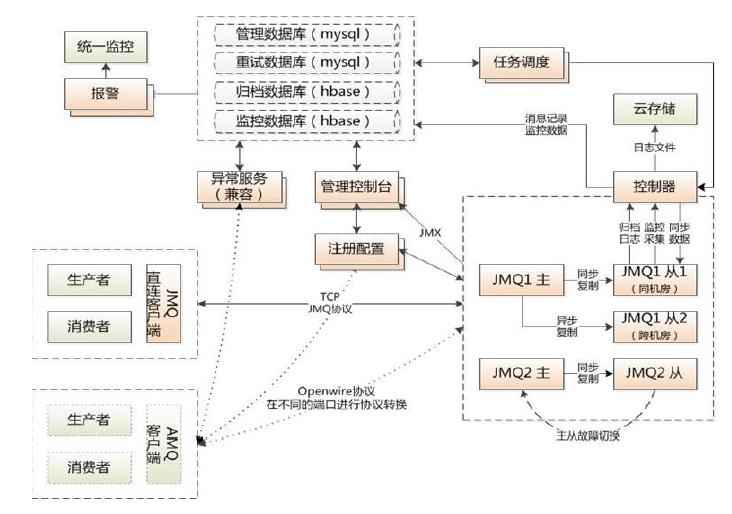

# JMQ（MQ）的基本概念

## 简介

- JMQ是京东自研的消息中间件，支持发布订阅模式，可用于系统间解藕及削峰平谷。
- 消息队列就是基础数据结构中的“先进先出”的一种数据机构。

### 基本结构图

## 使用参数

- 主题（topic）:消息的识别串，代表消息类型，全局唯一。
- 分片（存储数据的单元）：每个分片包含一主一从两个broker实例,主从自动同步,保存一份相同的数据。
- 服务端实例（broker）：主实例提供消息收发服务，从实例备份数据。
- 队列：基本的消息服务单元，JMQ一个broker默认分配5个队列。
- 应用/app：发送或接收消息的应用名称，全局唯一。
- businessId/业务ID：一条业务ID，用于归档查询。
- message/消息体：业务方通过JMQ传递的消息内容，在发送时客户端会对消息进行压缩。
- 消费者以topic，app维度接收一份完整的数据。
- 生产者向主题中发送10条消息，有3个应用消费这个主题。这种情况就是1个topic，3个app，所以每个应用会各自收到10条消息。
- 生产者向主题中发送10条消息。一个应用启动多个实例，来消费这个主题。这种情况就是1个topic，1个app，所以多个实例总共会收到10条消息。

## 消费方式

* 默认消费方式（批量消费）：
  - 客户端消费时，选择一个没有被占用的队列，从队列头部拉取10条消息。如果队列中积压消息小于10条，有多少拉取多少。
  - 服务端队列上锁，保证这个队列内的消息先进先出。
  - 消费完成后，服务端收到客户端的ack确认，队列解锁。
  - 客户端可以继续向后消费。消费确认命令队列客户端返回消息集合拉取消息命令消费返回ack上锁解锁

- 并行消费方式：
  - 开启并行消费后，队列是否上锁，由单队列最大并行数来控制。当客户端拉取消息时，服务端计算此队列上没有ack的消息总数，如果总数没有超过单队列最大并行数，可以从后续位置继续拉取消息。从而提高客户端拉取消息的效率。

## 消费性能

- 服务端最大出队能力
  * 影响因素：分片数（broker数量），单分片列队数，批量条数，单列对最大并行数，tpavg（一个批次消息的平均处理时长ms）
  * 不并行：最大出队tps：分片数 x 队列数 x 批量条数 x（1000/tpavg）x 损耗系数。
  * 并行：最大出队tps：分片数 x 队列数 x 单队列最大并行数 x (1000/tpavg) x 损耗系数

- 客户端的消费能力
  * 常见影响因素：客户端数量，客户端负载，业务复杂度，数据库瓶颈，依赖接口的性能最终体现在tpavg这个监控指标上

## 运维处理

- 加队列：可以提高客户端的并发数，在每个broker上增加queue的数量，但只对新增的消息有用，如果消息已经大量积压，即使调整队列数，之前积压的消息也不会转移到新创建的队列中来。队列数是针对主题的调整，也就是说调整队列数会对所有本主题的所有消费者都产生影响。如果消费者没有显式设置最大线程数量，则该值默认等于队列数。如果客户端负载已经很高，再增加队列数会造成客户端因线程增多而挂掉。所以不可以无限制增大队列数。

- 加分片：加分片是直接对topic增加分片，默认包含一主一从两个broker.因为物理资源有限，分片数量根据日常吞吐量来分配。用户在业务增长后，吞吐量增加后，可向jmq管理员申请加分片。

  

## 拓展

- 为什么使用消息队列？
  
- 解耦、异步、削峰
  
- 消息队列的缺点？
  - 系统可用性降低
  - 系统复杂度增加

- 消息队列类型：

  | 特性       | ActiveMQ                                                     | RabbitMQ                                                     | RocketMQ                 | kafka                                                        |
  | ---------- | ------------------------------------------------------------ | ------------------------------------------------------------ | ------------------------ | ------------------------------------------------------------ |
  | 开发语言   | java                                                         | erlang                                                       | java                     | scala                                                        |
  | 单机吞吐量 | 万级                                                         | 万级                                                         | 10万级                   | 10万级                                                       |
  | 时效性     | ms级                                                         | us级                                                         | ms级                     | ms级以内                                                     |
  | 可用性     | 高(主从架构)                                                 | 高(主从架构)                                                 | 非常高(分布式架构)       | 非常高(分布式架构)                                           |
  | 功能特性   | 成熟的产品，在很多公司得到应用；有较多的文档；各种协议支持较好 | 基于erlang开发，所以并发能力很强，性能极其好，延时很低;管理界面较丰富 | MQ功能比较完备，扩展性佳 | 只支持主要的MQ功能，像一些消息查询，消息回溯等功能没有提供，毕竟是为大数据准备的，在大数据领域应用广。 |

- 如何保证消息队列是高可用的

  - JMQ2(主从备份,一主一从):
    - 生产端：JMQ2的客户端会自动将发送失败的消息重发给同主题处于Broker的队列，切换过程中有可能短时出现**发送时延**升高，**极小概率会出现发送失败**的情况，切换完成后上述问题都会**自动恢复**。
    - 每个Broker都是一主一备的热备模式，备用Broker与主用Broker采用异步方式同步数据。主用Broker宕机后，消费端会自动切换到备用Broker，备用Broker上拥有主用Broker上绝大部分消息。可能存在少量新消息没来得及同步到备用Broker上，这部分消息暂时无法消费，但可以在主用Broker恢复后继续消费，不会丢失。
    - 在消费者端，Broker宕机后，仍然可以在备用Broker上继续消费，切换过程中有可能短时间出现**消费性能下降**，**消息被重复消费**，**消息乱序**，切换完成后上述问题都会**自动恢复**。
  - JMQ4:[raft一致性](https://raft.github.io/) [raft详解](https://www.cnblogs.com/likehua/p/5845575.html)（Leader、Follower、Candidate）**日志复制**。

- 如何保证消息不被重复消费
  - 成功消费后发送ack。
  - 拿到这个消息做数据库的insert操作，那就容易了，给这个消息做一个唯一的主键，那么就算出现重复消费的情况，就会导致主键冲突，避免数据库出现脏数据。
  - 拿到这个消息做redis的set的操作，那就容易了，不用解决，因为你无论set几次结果都是一样的，set操作本来就算幂等操作。
  - 第三方介质查询（ ？）

- 保证消费的可靠性传输（JMQ2会发生丢失）
  - 主用Broker磁盘损坏，无法读取数据。（JMQ2绝大部分服务器采用的是RAID5磁盘阵列，单盘损坏不会丢数据）
  - 数据没有来得及将消息复制到备用Broker上。
  - 消费者没有来得及消费这些消息。

- 重复性：提供 **至少一次（At-least-once）** 的消息投递保证。通俗的说就是**保证消息不丢，但不保证不重复**
- 有序性：普通不保证严格有序。严格有序只能有一个队列提供服务。

## 结构（网络消息，非内部资料，只做了解）

整体结构，系统包括服务端、客户端、管理端与其他支撑模块。

详细架构如下：

# Zookeeper

- 不能无限动态扩展，随着规模增大 需要同步到更多机器 tps 会下降 ，那么这就意味zk的集群不能很大，这就陷入了一个死循环，导致集群整体qps tps 都是有上限的大概5w到顶啦。
- 本身不是为高可用性设计，master撑不住高流量容易导致系统crash。当然，对网络隔离的敏感也导致Zookeeper的脆弱。
- Paxos算法的复杂性，选举过程或许缓慢，结合上一点，动辄需要重新选举master导致耗时过长。

# 消息队列

参考：[消息队列面试连环问：如何保证消息不丢失？处理重复消息？消息有序性？消息堆积处理？](https://www.cnblogs.com/linwenbin/p/13382753.html)

## 什么是消息队列

在计算机科学领域，消息队列和邮箱都是软件工程组件，通常用于进程间或同一进程内的线程通信。它们通过队列来传递消息-传递控制信息或内容，群组通信系统提供类似的功能。

简单的概括下上面的定义：**消息队列就是一个使用队列来通信的组件**。（见进程间的通信）

上面的定义没有错，但就现在而言我们日常所说的**消息队列常常指代的是消息中间件**，它的存在不仅仅只是为了通信这个问题。

## 为什么需要消息队列

异步、解耦、流量控制

## 消费队列基本概念

### 队列模型

生产者往某个队列里面发送消息，一个队列可以存储多少个生产者的消息，一个队列也可以有多少个消费者，但是消费者之间是竞争关系，即每条消息只能被一个消费者消费。

### 发布/订阅模型

**为了解决一条消息能被多个消费者消费的问题**，发布/订阅模型就来了。该模型是将消息发往一个`Topic`即主题中，所有订阅了这个 `Topic` 的订阅者都能消费这条消息。

其实可以这么理解，发布/订阅模型等于我们都加入了一个群聊中，我发一条消息，加入了这个群聊的人都能收到这条消息。那么队列模型就是一对一聊天，我发给你的消息，只能在你的聊天窗口弹出，是不可能弹出到别人的聊天窗口中的。

讲到这有人说，那我一对一聊天对每个人都发同样的消息不就也实现了一条消息被多个人消费了嘛。

是的，通过多队列全量存储相同的消息，即数据的冗余可以实现一条消息被多个消费者消费。`RabbitMQ` 就是采用队列模型，通过 `Exchange` 模块来将消息发送至多个队列，解决一条消息需要被多个消费者消费问题。

这里还能看到假设群聊里除我之外只有一个人，那么此时的发布/订阅模型和队列模型其实就一样了。

`RabbitMQ` 采用队列模型，`RocketMQ`和`Kafka` 采用发布/订阅模型。

### 常用术语

一般我们称发送消息方为生产者 `Producer`，接受消费消息方为消费者`Consumer`，消息队列服务端为`Broker`。

消息从`Producer`发往`Broker`，`Broker`将消息存储至本地，然后`Consumer`从`Broker`拉取消息，或者`Broker`推送消息至`Consumer`，最后消费。

为了提高并发度，往往**发布/订阅模型**还会引入**队列**或者**分区**的概念。即消息是发往一个主题下的某个队列或者某个分区中。`RocketMQ`中叫队列，`Kafka`叫分区，本质一样。

例如某个主题下有 5 个队列，那么这个主题的并发度就提高为 5 ，同时可以有 5 个消费者**并行消费**该主题的消息。一般可以采用轮询或者 `key hash` 取余等策略来将同一个主题的消息分配到不同的队列中。

与之对应的消费者一般都有组的概念 `Consumer Group`, 即消费者都是属于某个消费组的。一条消息会发往多个订阅了这个主题的消费组。

假设现在有两个消费组分别是`Group 1` 和 `Group 2`，它们都订阅了`Topic-a`。此时有一条消息发往`Topic-a`，那么这两个消费组都能接收到这条消息。

然后这条消息实际是写入`Topic`某个队列中，消费组中的某个消费者对应消费一个队列的消息。

在物理上除了副本拷贝之外，一条消息在`Broker`中只会有一份，每个消费组会有自己的`offset`即消费点位来标识消费到的位置。在消费点位之前的消息表明已经消费过了。当然这个`offset`是队列级别的。每个消费组都会维护订阅的`Topic`下的每个队列的`offset`。

## 如何保证消息不丢失

### 生产消息

生产者发送消息至`Broker`，需要处理`Broker`的响应，不论是同步还是异步发送消息，同步和异步回调都需要做好`try-catch`，妥善的处理响应，如果`Broker`返回写入失败等错误消息，需要重试发送。当多次发送失败需要作报警，日志记录等。

这样就能保证在生产消息阶段消息不会丢失。

### 存储消息

存储消息阶段需要在**消息刷盘之后**再给生产者响应，假设消息写入缓存中就返回响应，那么机器突然断电这消息就没了，而生产者以为已经发送成功了。

如果`Broker`是集群部署，有多副本机制，即消息不仅仅要写入当前`Broker`,还需要写入副本机中。那配置成至少写入两台机子后再给生产者响应。这样基本上就能保证存储的可靠了。一台挂了还有一台还在呢（假如怕两台都挂了..那就再多些）。

异地多活。

### 消费消息

这里经常会有同学犯错，有些同学当消费者拿到消息之后直接存入内存队列中就直接返回给`Broker`消费成功，这是不对的。

你需要考虑拿到消息放在内存之后消费者就宕机了怎么办。所以我们应该在**消费者真正执行完业务逻辑之后，再发送给`Broker`消费成功**，这才是真正的消费了。

所以只要我们在消息业务逻辑处理完成之后再给`Broker`响应，那么消费阶段消息就不会丢失。

## 处理重复消息

我们先来看看能不能避免消息的重复。

假设我们发送消息，就管发，不管`Broker`的响应，那么我们发往`Broker`是不会重复的。

但是一般情况我们是不允许这样的，这样消息就完全不可靠了，我们的基本需求是消息至少得发到`Broker`上，那就得等`Broker`的响应，那么就可能存在`Broker`已经写入了，当时响应由于网络原因生产者没有收到，然后生产者又重发了一次，此时消息就重复了。

再看消费者消费的时候，假设我们消费者拿到消息消费了，业务逻辑已经走完了，事务提交了，此时需要更新`Consumer offset`了，然后这个消费者挂了，另一个消费者顶上，此时`Consumer offset`还没更新，于是又拿到刚才那条消息，业务又被执行了一遍。于是消息又重复了。

可以看到正常业务而言**消息重复是不可避免的**，因此我们只能从**另一个角度**来解决重复消息的问题。

关键点就是**幂等**。既然我们不能防止重复消息的产生，那么我们只能在业务上处理重复消息所带来的影响。

### 幂等处理消息

幂等是数学上的概念，我们就理解为同样的参数多次调用同一个接口和调用一次产生的结果是一致的。

例如这条 SQL`update t1 set money = 150 where id = 1 and money = 100;` 执行多少遍`money`都是150，这就叫幂等。

因此需要改造业务处理逻辑，使得在重复消息的情况下也不会影响最终的结果。

可以通过上面我那条 SQL 一样，做了个**前置条件判断**，即`money = 100`情况，并且直接修改，更通用的是做个`version`即版本号控制，对比消息中的版本号和数据库中的版本号。

或者通过**数据库的约束例如唯一键**，例如`insert into update on duplicate key...`。

或者**记录关键的key**，比如处理订单这种，记录订单ID，假如有重复的消息过来，先判断下这个ID是否已经被处理过了，如果没处理再进行下一步。当然也可以用全局唯一ID等等。

基本上就这么几个套路，**真正应用到实际中还是得看具体业务细节**。

## 保证有序性

### 全局有序

如果要保证消息的全局有序，首先只能由一个生产者往`Topic`发送消息，并且一个`Topic`内部只能有一个队列（分区）。消费者也必须是单线程消费这个队列。这样的消息就是全局有序的！

不过一般情况下我们都不需要全局有序，即使是同步`MySQL Binlog`也只需要保证单表消息有序即可。

### 部分有序

因此绝大部分的有序需求是部分有序，部分有序我们就可以将`Topic`内部划分成我们需要的队列数，把消息通过特定的策略发往固定的队列中，然后每个队列对应一个单线程处理的消费者。这样即完成了部分有序的需求，又可以通过队列数量的并发来提高消息处理效率。

## 消息堆积

消息的堆积往往是因为**生产者的生产速度与消费者的消费速度不匹配**。有可能是因为消息消费失败反复重试造成的，也有可能就是消费者消费能力弱，渐渐地消息就积压了。

因此我们需要**先定位消费慢的原因**，如果是`bug`则处理 `bug` ，如果是因为本身消费能力较弱，我们可以优化下消费逻辑，比如之前是一条一条消息消费处理的，这次我们批量处理，比如数据库的插入，一条一条插和批量插效率是不一样的。

假如逻辑我们已经都优化了，但还是慢，那就得考虑水平扩容了，增加`Topic`的队列数和消费者数量，**注意队列数一定要增加**，不然新增加的消费者是没东西消费的。**一个Topic中，一个队列只会分配给一个消费者**。

当然你消费者内部是单线程还是多线程消费那看具体场景。不过要注意上面提高的消息丢失的问题，如果你是将接受到的消息写入**内存队列**之后，然后就返回响应给`Broker`，然后多线程向内存队列消费消息，假设此时消费者宕机了，内存队列里面还未消费的消息也就丢了。