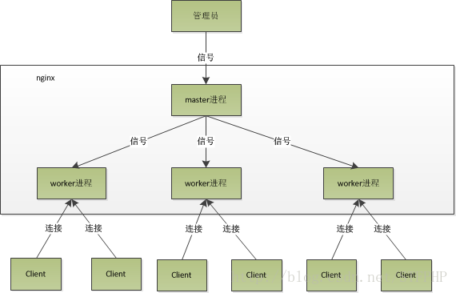
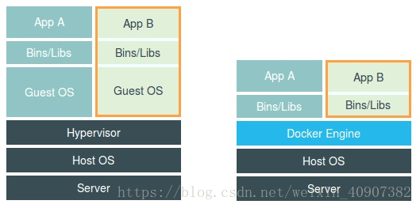
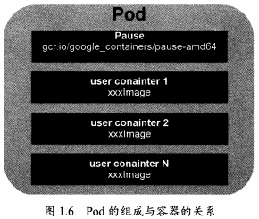

# nginx

## 什么是nginx

Nginx ("engine x")是一个高性能的HTTP和反向代理服务器，特点是占有内存少，并发能力强，事实上nginx的并发能力确实在同类型的网页服务器中表现较好    Nginx专为性能优化而开发，性能是其最重要的考量，实现上非常注重效率，能经受高负载的考验，有报告表明能支持高达50000个并发连接数。

## 正向代理与反向代理

- 正向代理即是客户端代理, 代理客户端, 服务端不知道实际发起请求的客户端.

- 反向代理即是服务端代理, 代理服务端, 客户端不知道实际提供服务的服务端

## 负责均衡

### 轮询

每个请求按时间顺序逐一分配到不 同的后端服务器，如果后端服务器down掉，能自动剔除

### weight

weight代表权重默认为1,权重越高被分配的客户端越多。
指定轮询几率，weight和访问比率成正比，用于后端服务器性能不均的情况。

### ip hash

每个请求按访问ip的hash结果分配, 这样每个访客固定访问一个后端服务器,可以解诀session的问题。

### least_conn

把请求转发给连接数较少的后端服务器。轮询算法是把请求平均的转发给各个后端，使它们的负载大致相同；但是，有些请求占用的时间很长，会导致其所在的后端负载较高。这种情况下，least_conn这种方式就可以达到更好的负载均衡效果。

### fair(第三方)

按后端服务器的响应时间来分配请求，响应时间短的优先分配

## 动静分离

Nginx 动静分离简单来说就是把动态跟静态请求分开，不能理解成只是单纯的把动态页面和静态页面物理分离。严格意义上说应该是动态请求跟静态请求分开，可以理解成使用Nginx 处理静态页面，Tomcat、 Resin 出来动态页面。动静分离从目前实现角度来讲大致分为两种，

一种是纯粹把静态文件独立成单独的域名，放在独立的服务器上，也是目前主流推崇的方案；

另外一种方法就是动态跟静态文件混合在一起发布，通过 nginx 来分开。这样也是本次课程要讲解的，具体怎么来实现呢，

通过 location 指定不同的后缀名实现不同的请求转发。通过 expires 参数设置，可以使浏览器缓存过期时间，减少与服务器之前的请求和流量。具体 Expires 定义：是给一个资源设定一个过期时间，也就是说无需去服务端验证，直接通过浏览器自身确认是否过期即可，所以不会产生额外的流量。此种方法非常适合不经常变动的资源。（如果经常更新的文件，不建议使用 Expires 来缓存），我这里设置 3d，表示在这 3 天之内访问这个 URL，发送一个请求，比对服务器该文件最后更新时间没有变化，则不会从服务器抓取，返回状态码 304，如果有修改，则直接从服务器重新下载，返回状态码 200。

## 高可用

主、备份nginx服务器，使用**keepalived**虚拟出来一台 虚拟网关vip（不真实存在，自然不存在宕机问题），

此vip由两台机器共同协商生成。当有一台机器宕机时，另一台机器一样能维持vip。这保证了，只要两台机器不同时宕机，vip就存在

## nginx工作原理

Nginx 采用的是多进程（单线程） & 多路IO复用模型。使用了 I/O 多路复用技术的 Nginx，就成了”并发事件驱动“的服务器。

### 多进程的工作模式

- 1、Nginx 在启动后，会有一个 master 进程和多个相互独立的 worker 进程。
- 2、接收来自外界的信号，向各worker进程发送信号，每个进程都有可能来处理这个连接。
- 3、 master 进程能监控 worker 进程的运行状态，当 worker 进程退出后(异常情况下)，会自动启动新的 worker 进程。

### 惊群现象

- 主进程（master 进程）首先通过 socket() 来创建一个 sock 文件描述符用来监听，然后fork生成子进程（workers 进程），子进程将继承父进程的 sockfd（socket 文件描述符），之后子进程 accept() 后将创建已连接描述符（connected descriptor）），然后通过已连接描述符来与客户端通信。
- 那么，由于所有子进程都继承了父进程的 sockfd，那么当连接进来时，所有子进程都将收到通知并“争着”与它建立连接，这就叫“惊群现象”。大量的进程被激活又挂起，只有一个进程可以accept() 到这个连接，这当然会消耗系统资源。

### Nginx对惊群现象的处理：

Nginx 提供了一个 accept_mutex 这个东西，这是一个加在accept上的一把互斥锁。即每个 worker 进程在执行 accept 之前都需要先获取锁，获取不到就放弃执行 accept()。有了这把锁之后，同一时刻，就只会有一个进程去 accpet()，这样就不会有惊群问题了。accept_mutex 是一个可控选项，我们可以显示地关掉，默认是打开的。

### worker进程工作流程

当一个 worker 进程在 accept() 这个连接之后，就开始读取请求，解析请求，处理请求，产生数据后，再返回给客户端，最后才断开连接，一个完整的请求。一个请求，完全由 worker 进程来处理，而且只能在一个 worker 进程中处理。

- 1、节省锁带来的开销。每个 worker 进程都是独立的进程，不共享资源，不需要加锁。同时在编程以及问题查上时，也会方便很多。
- 2、独立进程，减少风险。采用独立的进程，可以让互相之间不会影响，一个进程退出后，其它进程还在工作，服务不会中断，master 进程则很快重新启动新的 worker 进程。当然，worker 进程的也能发生意外退出。

### 多进程模型每个进程/线程只能处理一路IO，那么 Nginx是如何处理多路IO呢？

1. 如果不使用 IO 多路复用，那么在一个进程中，同时只能处理一个请求，比如执行 accept()，如果没有连接过来，那么程序会阻塞在这里，直到有一个连接过来，才能继续向下执行。
2. 而多路复用，允许我们只在事件发生时才将控制返回给程序，而其他时候内核都挂起进程，随时待命。

　　**核心：Nginx采用的 IO多路复用模型epoll**
　　epoll通过在Linux内核中申请一个简易的文件系统（文件系统一般用什么数据结构实现？B+树），其工作流程分为三部分：

- 1、调用 int epoll_create(int size)建立一个epoll对象，内核会创建一个eventpoll结构体，用于存放通过epoll_ctl()向epoll对象中添加进来的事件，这些事件都会挂载在红黑树中。
- 2、调用 int epoll_ctl(int epfd, int op, int fd, struct epoll_event *event) 在 epoll 对象中为 fd 注册事件，所有添加到epoll中的事件都会与设备驱动程序建立回调关系，也就是说，当相应的事件发生时会调用这个sockfd的回调方法，将sockfd添加到eventpoll 中的双链表。
- 3、调用 int epoll_wait(int epfd, struct epoll_event * events, int maxevents, int timeout) 来等待事件的发生，timeout 为 -1 时，该调用会阻塞知道有事件发生
  　　

这样，注册好事件之后，只要有 fd 上事件发生，epoll_wait() 就能检测到并返回给用户，用户就能”非阻塞“地进行 I/O 了。

　　epoll() 中内核则维护一个链表，epoll_wait 直接检查链表是不是空就知道是否有文件描述符准备好了。（epoll 与 select 相比最大的优点是不会随着 sockfd 数目增长而降低效率，使用 select() 时，内核采用轮训的方法来查看是否有fd 准备好，其中的保存 sockfd 的是类似数组的数据结构 fd_set，key 为 fd，value 为 0 或者 1。）

　　能达到这种效果，是因为在内核实现中 epoll 是根据每个 sockfd 上面的与设备驱动程序建立起来的回调函数实现的。那么，某个 sockfd 上的事件发生时，与它对应的回调函数就会被调用，来把这个 sockfd 加入链表，其他处于“空闲的”状态的则不会。在这点上，epoll 实现了一个”伪”AIO。但是如果绝大部分的 I/O 都是“活跃的”，每个 socket 使用率很高的话，epoll效率不一定比 select 高（可能是要维护队列复杂）。

可以看出，因为一个进程里只有一个线程，所以一个进程同时只能做一件事，但是可以通过不断地切换来“同时”处理多个请求。

### epoll库

 epoll库是Nginx服务器支持的高性能事件驱动库之一。它是公认的最好的事件驱动模型。和poll库及select库有很大的区别。

  poll和select都是创建一个待处理事件列表，然后把这个列表发给内核，返回的时候，再去轮询检查这个列表。以判断这个事件是否发生。在描述符太多的情况下，就会明显效率低下了。

  epoll是这么做的，它把事件描述符列表的管理交给内核复制。一旦有某个事件发生，内核将发生事件的事件描述符交给Nginx的进程，而不是将整个事件描述符列表交给进程，让进程去轮询具体是哪个描述符。epoll()避免了轮询整个事件描述符列表。所以显得更高效。

  epoll库的基本步骤：

  首先:epoll库通过相关调用通知内核创建一个有N个描述符的事件列表。然后给这个事件列表设置自己关心的事件。并把它添加到内核中。在具体的代码中还可以实现对相关调用的事件描述符列表进行修改和删除。

  之后，一旦设置完成就一直等待内核通知事件发生了，某一事件发生后，内核就将发生事件的描述符给epoll库，epoll库去处理事件。

[epoll、poll、select](https://segmentfault.com/a/1190000003063859#item-3-13)

# docker

https://blog.csdn.net/weixin_40907382/article/details/82659138

容器技术的兴起源于 PaaS 技术的普及；Docker 公司发布的 Docker 项目具有里程碑式的意义；Docker 项目通过“容器镜像”，解决了应用打包这个根本性难题。

由于计算机只认识 0 和 1，所以无论用哪种语言编写这段代码，最后都需要通过某种方式翻译成二进制文件，才能在计算机操作系统中运行起来。

而为了能够让这些代码正常运行，我们往往还要给它提供数据，比如我们这个加法程序所需要的输入文件。这些数据加上代码本身的二进制文件，放在磁盘上，就是我们平常所说的一个“程序”，也叫代码的可执行镜像（executable image）。

然后，我们就可以在计算机上运行这个“程序”了。

首先，操作系统从“程序”中发现输入数据保存在一个文件中，所以这些数据就被会加载到内存中待命。同时，操作系统又读取到了计算加法的指令，这时，它就需要指示 CPU 完成加法操作。而 CPU 与内存协作进行加法计算，又会使用寄存器存放数值、内存堆栈保存执行的命令和变量。同时，计算机里还有被打开的文件，以及各种各样的 I/O 设备在不断地调用中修改自己的状态。

就这样，一旦“程序”被执行起来，它就从磁盘上的二进制文件，变成了计算机内存中的数据、寄存器里的值、堆栈中的指令、被打开的文件，以及各种设备的状态信息的一个集合。像这样一个程序运起来后的计算机执行环境的总和，就是我们今天的主角：进程。

所以，对于进程来说，它的静态表现就是程序，平常都安安静静地待在磁盘上；而一旦运行起来，它就变成了计算机里的数据和状态的总和，这就是它的动态表现。

而容器技术的核心功能，就是通过约束和修改进程的动态表现，从而为其创造出一个“边界”。

对于 Docker 等大多数 Linux 容器来说，Cgroups 技术是用来制造约束的主要手段，而Namespace 技术则是用来修改进程视图的主要方法。

在使用 Docker 的时候，并没有一个真正的“Docker 容器”运行在宿主机里面。Docker 项目帮助用户启动的，还是原来的应用进程，只不过在创建这些进程时，Docker 为它们加上了各种各样的 Namespace 参数。

Linux Cgroups 的全称是 Linux Control Group。它最主要的作用，就是限制一个进程组能够使用的资源上限，包括 CPU、内存、磁盘、网络带宽等等。此外，Cgroups 还能够对进程进行优先级设置、审计，以及将进程挂起和恢复等操作。

# k8s

云端教父AWS云端架构策略副总裁Adrian Cockcroft曾指出，两者虽然都是运用容器技术，但最大的差异是，Docker是要解决应用程序开发（Developing）问题，而Kubernetes是要解决更上层的应用程序运维问题（Operation）。开发问题是早期的痛点，但随着企业越来越依赖容器技术，内部应用越来越多是云原生应用时，运维会是企业IT的新痛点。

K8s是用于自动部署、扩展和管理容器化（containerized）应用程序的开源系统:

- 自动化容器的部署和复制
- 随时扩展或收缩容器规模
- 将容器组织成组，并且提供容器间的负载均衡
- 很容易地升级应用程序容器的新版本
- 提供容器弹性，如果容器失效就替换它，等等...

## 集群

在集群管理方面，K8s将集群中的机器划分为一个Master节点和一群工作节点Node。Master节点上运行着集群管理相关的一组进程kube-apiserver、kube-controller-manager和kube-scheduler。这些进程自动化实现了整个集群的资源管理、Pod调度、弹性伸缩、安全控制、系统监控和纠错等管理功能。

上图可以看到如下组件，使用特别的图标表示Service和Label：

- Kubernetes Master（Kubernetes主节点）
- Node（节点）
- Pod
- Container（容器）
- Label(label)（标签）
- Replication Controller（复制控制器）
- Service（enter image description here）（服务）

## Kubernetes Master

Master指的是集群控制节点。每个K8s集群里需要有一个Ms节点负责整个集群的管理和控制。Kubernetes Master提供集群的独特视角，并且拥有一系列组件。

- Kubernetes API Server（kube-apiserver），侍卫大统领！提供HTTP Rest接口的关键服务进程，是K8s里所有资源的增删改查等操作的唯一入口，也是集群控制的入口进程。API Server提供可以用来和集群交互的Rest端点。
- Kubernetes Controller Master（kube-controller-manager）掌印大太监，大总管！K8s里所有资源对象的自动化控制中心。
- Kubernetes Scheduler（kube-scheduler），御马间的调度室！负责资源调度（Pod调度）的进程。创建和复制Pod的Replication Controller。

## Node

节点（上图橘色方框）是物理或者虚拟机器，作为Kubernetes worker，通常称为Minion。每个节点都运行如下Kubernetes关键组件。

> (1) Kubelet：与Master节点协作，是主节点的代理，负责Pod对应容器的创建，启动，停止等任务。默认情况下Kubelet会向Master注册自己。Kubelet定期向主机点汇报加入集群的Node的各类信息。
> (2) Kube-proxy：Kubernetes Service使用其将链接路由到Pod，作为外部负载均衡器使用，在一定数量的Pod之间均衡流量。比如，对于负载均衡Web流量很有用。
> (3) Docker或Rocket：Kubernetes使用的容器技术来创建容器。

## Pod

Pod是K8s最重要也是最基础的概念！每个Pod都有一个特殊的被称为“根容器”的Pause容器，此容器与引入业务无关并且不易死亡。且以它的状态代表整个容器组的状态！Pause容器对应的镜像属于K8s平台的一部分，除了Pause容器，每个Pod还包含一个或多个用户业务容器。Pod其实有两种类型：普通的Pod及静态Pod（static Pod）,static Pod并不存放在Kubemetes的eted存储里，而是存放在某个具体的Node上的一个具体文件中，并且只在此Node上启动运行。而普通的Pod一旦被创建，就会被放入到etcd中存储，确后会被KubernetesMaster调度到某个具体的Node上并进行绑定（Binding），随后该Pod被对应的Node上的kubelet进程实例化成一组相关的Docker容器并启动起来。在默认情况下，当Pod里的某个容器停止时，Kubemetes会自动检测到这个问题并且重新启动这个Pod（重启Podel）的所有容器），如果Pod所在的Node完机，则会将这个Node上的所有Pod重新调度到其他节点上。Pod（上图绿色方框）安排在节点上，包含一组容器和卷。同一个Pod里的容器共享同一个网络命名空间，可以使用localhost互相通信。

## Lable

Lable类似Docker中的tag，一个是对“特殊”镜像、容器、卷组等各种资源做标记，一个是attach到各种诸如Node、Pod、Server、RC资源对象上。不同的是Lable是一对键值对！Lable类似Tag，可使用K8s专有的标签选择器（Label Selector）进行组合查询。

## Replication Controller

Replication Controller，简称RC，她用来干啥呢？就是通过她来实现Pod副本数量的自动控制！RC确保任意时间都有指定数量的Pod“副本”在运行。

> 如果为某个Pod创建了RC并且指定3个副本，它会创建3个Pod，并且持续监控它们。如果某个Pod不响应，那么Replication Controller会替换它，保持总数为3。如果之前不响应的Pod恢复了，现在就有4个Pod了，那么Replication Controller会将其中一个终止保持总数为3。如果在运行中将副本总数改为5，Replication Controller会立刻启动2个新Pod，保证总数为5。还可以按照这样的方式缩小Pod，这个特性在执行滚动升级时很有用。
> 注意：删除RC，不会影响该RC已经创建好的Pod。在逻辑上Pod副本和RC是解耦和的！创建RC时，需要指定Pod模板（用来创建Pod副本的模板）和Label（RC需要监控的Pod标签）。
> 由Replication Controller衍生出Deployment，与RC相似90%，目的是更好地解决Pod编排。暂时不讨论。
> Horizontal Pod Autoscaler，简称HPA，Pod横向自动扩容智能控件。与RC，Deployment一样，也属于K8s的一种资源对象。她的实现原理是通过追踪分析RC控制的所有目标Pod的负载变化情况，来确定是否针对性地调整目标Pod的副本数。

## Service

微服务架构中的一个“微服务”，她是正真的新娘，而之前的Pod，RC等资源对象其实都是嫁衣。
每个Pod都会被分配一个单独的IP地址，而且每个Pod都提供了一个独立的Endpoint（Pod lP + ContainerPort）以被客户端访问，现在多个Pod副本组成了一个集群来提供服务，客户端要想访问集群，一般的做法是部署一个负载均衡器（软件或硬件），为这组Pod开启一个对外的服务端口如8000端口，并且将这些Pod的Endpoint列表加入8000端口的转发列表中，客户端就可以通过负载均衡器的对外IP地址 + 服务端口来访问此服务，而客户端的请求最后会被转发到哪个Pod，则由负载均衡器的算法所决定。

K8s的server定义了一个服务的访问入口地址，前端（Pod）通过入口地址访问其背后的一组由Pod副本组成的集群实例，service与其后端Pod副本集群之间通过Label Selector 实现“无缝对接”。

> 可以将Server抽象成特殊的扁平的双向管道，Service借助Label Selector保证了前端容器正确可靠地指向对应的后台容器。 RC的作用保证了Service的服务能力和服务质量始终处于预期的标准。

Kubemetes也遵循了上述常规做法，运行在每个Node上的kube-proxy进程其实就是一个智能的软件负载均衡器，它负责把对Service的请求转发到后端的某个Pod实例上，并在内部实现服务的负载均衡与会话保持机制。但Kubernetes发明了一种很巧妙又影响深远的设计：Service不是共用一个负载均衡器的IP地址，而是每个Service分配了一个全局唯一的虚拟IP地址，这个虚拟IP被称为ClusterIP。这样一来，每个服务就变成了具备唯一IP地址的“通信节点”，服务调用就变成了最基础的TCP网络通信问题。

> Pod的Endpoint地址会随着Pod的销毁和重新创建而发生改变，因为新Pod的IP地址与之前旧Pod的不同。而Service一旦创建，Kubemetes就会自动为它分配一个可用的Cluster IP，而且在Service的整个生命周期内，它的ClusterIP不会发生改变。于是，服务发现这个棘手的问题Kubemetes的架构里也得以轻松解决：只要用Service的Name与Service的Cluster IP地址做一个DNS域名映射即可完美解决问题。