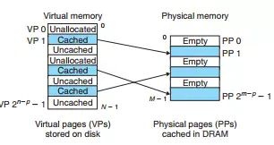
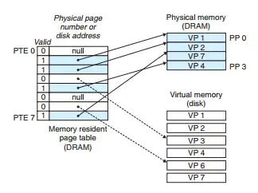
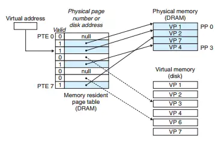
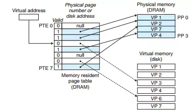
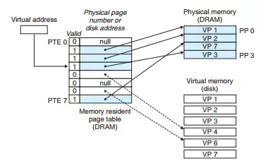
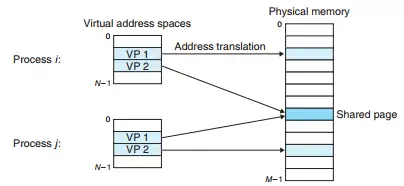
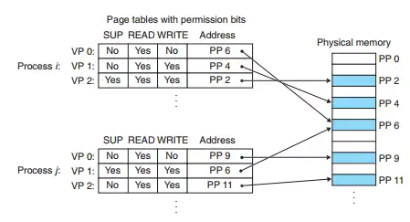
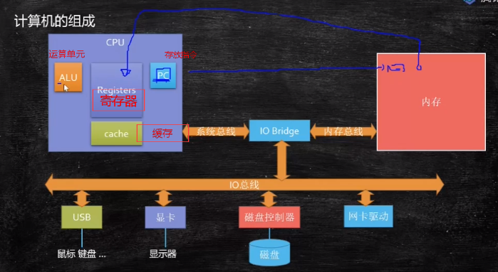

# 操作系统

## 物理内存和虚拟内存

### 物理内存

- 内存条，在32位平台下，寻址范围是<a href="https://www.codecogs.com/eqnedit.php?latex=\inline&space;\dpi{100}&space;\large&space;2^{32}" target="_blank"></a>也就是4G，还需保留一些给硬件使用，实际并不能全部使用4G。

### 虚拟内存

虚拟内存提供了三个重要的能力： **缓存**，**内存管理**，**内存保护**

1. 将主存视为一个存储在磁盘上的地址空间的高速缓存，在主存中只保存活动区域，并根据需要在磁盘和主存之间来回传送数据

2. 为每个进程提供了一致的地址空间，简化内存管理

3. 保护了每个进程的地址空间不被其他进程破坏

### 虚拟内存作为缓存的工具

概念上，虚拟内存被组织为一个由存放在磁盘上的N个连续字节大小的单元组成的数组。每字节都有一个唯一的虚拟地址，作为数组的索引。磁盘上的内容被缓存在主存中。

VM系统将虚拟内存分割为大小固定的块，称为**虚拟页（VP）**，来作为磁盘和主存之间的传输单元。每个虚拟页的大小为P=2^p字节。类似地，物理内存也被分割为**物理页（PP）**（也称为**页帧**），大小也是P字节。

虚拟页面分为三个互斥子集：

1. **未分配的**：VM系统还未分配（或创建的）页。未分配的块没有任何数据和它们相关联，因此也就不占用任何磁盘空间。

2. **缓存的**：当前已缓存在物理内存中的已分配的页。

3. **未缓存的**：未缓存在物理内存中的已分配的页。



如上图：有8个虚拟页。虚拟页0和3未分配，因此在磁盘上还不存在。虚拟页1、4和6被缓存在物理内存中。页2、5和7已经被分配了，但是当前并未缓存在主存中。

#### 页表

虚拟内存必须知道一个虚拟页是否放在物理页中，如果在物理页中，也需知道与之关联的物理页的具体物理地址。如果不在物理页中，需要选择一个牺牲页，要将该虚拟页从磁盘**复制**到DRAM中，并将被替换的牺牲页保存到磁盘中。

这些功能是由软硬件联合提供的。VM系统要实现上面的功能需要操作系统软件、MMU（内存管理单元）中的地址翻译硬件和一个存放在物理内存中叫`页表`的数据结构帮助。页表就是记录了虚拟页和物理页映射关系的一种数据结构。每次地址翻译硬件将一个虚拟地址转换为物理地址时，都需要读取页表。操作系统负责维护页表的内容，以及在磁盘与DRAM之间来回传送页。



上图展示了一个页表的基本组织结构。虚拟地址空间中的每个页在页表中一个固定偏移量处都有一个**页表条目(PTE)**。假设一个PTE由一个有效位和一个n位地址字段组成的。有效位表示该虚拟页当前是否缓存在主存（DRAM）中。如果设置了有效位，那么一个空地址表示这个虚拟页还未被分配。否则，这个地址就指向该虚拟页在磁盘上的起始位置。

图中展示了8个虚拟页和4个物理页。四个虚拟页(VP1、VP2、VP7和VP4)当前被缓存在DRAM中。两个页（VP0、VP5）还未被分配，而剩下的页（VP3和VP6）已经被分配了，但还未被缓存在DRAM中。

#### 页命中

页命中是指，该虚拟页面是缓存的。

如图，VP2被缓存在DRAM中。当CPU想要读取包含在VP2中的虚拟页的一个字时，地址翻译硬件将虚拟地址作为索引并根据页表中的PTE2来定位其物理地址，之后通过内存总线读取它。系统通过PTE2中标志位判定VP2是已经缓存在DRAM中。



#### 缺页

习惯上，DRAM中缓存不命中称为**缺页**。



上图展示了在缺页之前的页表状态的一个示例。CPU引用了VP3的一个字，VP3并未被缓存在DRAM中。地址翻译硬件从内存中读取PTE3，从有效位推断出VP3未被缓存，进而**触发了一个缺页异常**。

缺页异常调用内核中的缺页异常处理程序，该程序会选择一个牺牲页，图例中就是存放在PP3中的VP4。如果VP4已经被修改了，那么内核就会将它复制回磁盘。无论如何，内核都会修改VP4的页表条目PTE4，反映出VP4不在缓存在主存中这一事实。



然后，内核会从磁盘复制VP3到内存中的PP3，更新PP3，随后返回。当异常处理程序返回时，它会重新启动导致缺页的指令，该指令会把导致缺页的虚拟地址重发送到地址翻译硬件。但是现在，VP3已经缓存在主存中了，页命中也能由地址翻译硬件正常处理。

### 虚拟内存作为内存管理的工具

操作系统为每个进程提供一个独立的`页表`，因而也就是独立的虚拟地址空间。



如上图所示，进程i的页表将VP1映射到PP2，VP2映射到PP7。相似的，进程j将VP1映射到PP7，VP2映射到PP10.注意，多个虚拟页面可以映射到同一个`共享的物理页面`上。

#### 简化链接

独立地址空间允许每个进程的内存映像使用相同的基本格式。例如在64位x86-64平台上，代码段总是从虚拟地址0x400000开始。数据段跟在代码段后，中间夹杂着对齐空白。栈占据用户进程地址空间的最高部分，并向下增长。这样的一致性极大地简化了链接器的设计和实现，运行链接器生成完全连接的可执行文件，这些可执行文件是独立于物理内存中代码和数据的最终位置的。


#### 简化加载

把目标文件（可执行文件和共享对象文件）中的.text和.data节加载到一个新创建的进程中，Linux加载器为代码和数据段分配虚拟页，把他们标记为无效的（即未被缓存的），将页表条目指向目标文件中适当的位置。然而，加载器从不从磁盘复制任何数据到内存中，而在每个页被初次引用时，或CPU取指令时，或一条正在执行的指令引用一个内存位置时，虚拟内存系统会按需自动调入数据页。

#### 简化共享

一般情况下，每个进程都有自己私有的代码、数据、堆、以及栈区域，是不和其他进程共享的。在这种情况下，操作系统创建页表，将相应的虚拟页映射到不连续的物理页面。

独立地址空间为操作系统提供了一个管理用户进程和操作系统自身之间共享的一致机制。

在部分情况下，进程间还是需要共享代码和数据的，例如每个C程序都会调用C标准库中的程序（printf）、都需要调用相同的内核代码。操作系统通过将不同进程中适当的虚拟页面映射到相同的物理页面，从而安排多个进程共享这部分代码的一个副本，而不是在每个进程中都包括单独的内核和C标准库的副本。

#### 简化内存分配

当运行在用户进程的程序要求额外的堆空间时（如调用malloc），操作系统分配k个连续的虚拟内存页面，并且将它们映射到物理内存中任意位置的k个任意的物理页面。由于页表的存在，操作系统没必要分配k个连续的物理页面，页面可随机地分散在物理内存中。

### 虚拟内存作为内存保护的工具

操作系统会控制进程对内存系统的访问，例如：

1. 不允许一个用户进程修改它的只读代码段；

2. 不允许用户进程读或修改任何内核中的代码和数据结构；

3. 不允许用户进程读或写其他进程的私有内存；

4. 不允许用户进程修改任何其他进程共享的虚拟页表

而提供独立的地址空间是的区分不同进程的私有内存变得容易。但是，地址翻译机制可以从一种自然的方式扩展到提供更好的访问控制。CPU每次生成一个地址时，地址翻译硬件都会读一个PTE。所以通过在PTE上添加额外的许可位来控制对一个虚拟页面内容的访问十分简单。



上图中，在每个PTE中添加了三个许可位。**SUP**位表示进程是否必须运行在内核模式下才能访问该页。运行在内核模式下的进程可以访问任何页面，但运行在用户模式中的进程只允许访问那些**SUP**为0的页面。**READ**和**WRITE**位控制对页面的读和写访问。例如，如果进程i运行在用户模式下，那么它有读VP0和读写VP1的权限。然而，不允许访问VP2。

如果一条指令违反了这些许可条件，那么CPU就会触发一个一般保护故障，将控制传递给一个内核中的异常处理程序。Liunx中一般将这种异常报告为**段错误（segmentation fault）**

## cpu缓存


- 缓存行64字节。

## MESI协议

是以缓存行(缓存的基本数据单位，在Intel的CPU上一般是64字节)的几个状态来命名的(全名是Modified、Exclusive、 Share or Invalid)。该协议要求在每个缓存行上维护两个状态位，使得每个数据单位可能处于M、E、S和I这四种状态之一，各种状态含义如下：

​    **M：被修改的。处于这一状态的数据，只在本CPU中有缓存数据，而其他CPU中没有。同时其状态相对于内存中的值来说，是已经被修改的，且没有更新到内存中。
​    E：独占的。处于这一状态的数据，只有在本CPU中有缓存，且其数据没有修改，即与内存中一致。
​    S：共享的。处于这一状态的数据在多个CPU中都有缓存，且与内存一致。
​    I：无效的。本CPU中的这份缓存已经无效。**

   一个处于M状态的缓存行，必须时刻监听所有试图读取该缓存行对应的主存地址的操作，如果监听到，则必须在此操作执行前把其缓存行中的数据写回CPU。
    一个处于S状态的缓存行，必须时刻监听使该缓存行无效或者独享该缓存行的请求，如果监听到，则必须把其缓存行状态设置为I。
    一个处于E状态的缓存行，必须时刻监听其他试图读取该缓存行对应的主存地址的操作，如果监听到，则必须把其缓存行状态设置为S。

​    当CPU需要读取数据时，如果其缓存行的状态是I的，则需要从内存中读取，并把自己状态变成S，如果不是I，则可以直接读取缓存中的值，但在此之前，必须要等待其他CPU的监听结果，如其他CPU也有该数据的缓存且状态是M，则需要等待其把缓存更新到内存之后，再读取。

​    当CPU需要写数据时，只有在其缓存行是M或者E的时候才能执行，否则需要发出特殊的RFO指令(Read Or Ownership，这是一种总线事务)，通知其他CPU置缓存无效(I)，这种情况下性能开销是相对较大的。在写入完成后，修改其缓存状态为M。

## 计算机组成



## IO操作

[IO复用](https://www.cnblogs.com/nr-zhang/p/10483011.html)

[事件驱动模型和异步IO多路复用](https://www.cnblogs.com/sunhao96/p/7873842.html)

[select、poll、epoll之间的区别(搜狗面试)](https://www.cnblogs.com/aspirant/p/9166944.html)

IO分两阶段：

```
1.数据准备阶段
2.内核空间复制回用户进程缓冲区阶段
```

一般来讲：阻塞IO模型、非阻塞IO模型、IO复用模型(select/poll/epoll)、信号驱动IO模型都属于同步IO，因为阶段2是阻塞的(尽管时间很短)。只有异步IO模型是符合POSIX异步IO操作含义的，不管在阶段1还是阶段2都可以干别的事。

### blocking IO （阻塞IO）

当用户进程调用了recvfrom这个系统调用，kernel（内核）就开始了IO的第一个阶段：准备数据（对于网络IO来说，很多时候数据在一开始还没有到达。比如，还没有收到一个完整的UDP包。这个时候kernel就要等待足够的数据到来）。这个过程需要等待，也就是说数据被拷贝到操作系统内核的缓冲区中是需要一个过程的。而在用户进程这边，整个进程会被阻塞（当然，是进程自己选择的阻塞）。当kernel一直等到数据准备好了，它就会将数据从kernel中拷贝到用户内存，然后kernel返回结果，用户进程才解除block的状态，重新运行起来。
所以，blocking IO的特点就是在IO执行的两个阶段都被block了。

### 非阻塞 I/O（nonblocking IO）

当用户进程发出read操作时，如果kernel中的数据还没有准备好，那么它并不会block用户进程，而是立刻返回一个error。从用户进程角度讲 ，它发起一个read操作后，并不需要等待，而是马上就得到了一个结果。用户进程判断结果是一个error时，它就知道数据还没有准备好，于是它可以再次发送read操作。一旦kernel中的数据准备好了，并且又再次收到了用户进程的system call，那么它马上就将数据拷贝到了用户内存，然后返回。
所以，nonblocking IO的特点是用户进程需要不断的主动询问kernel数据好了没有。

### I/O 多路复用（ IO multiplexing）

IO multiplexing就是我们说的select，poll，epoll，有些地方也称这种IO方式为event driven IO。select/epoll的好处就在于单个process就可以同时处理多个网络连接的IO。它的基本原理就是select，poll，epoll这个function会不断的轮询所负责的所有socket，当某个socket有数据到达了，就通知用户进程。

当用户进程调用了select，那么整个进程会被block，而同时，kernel会“监视”所有select负责的socket，当任何一个socket中的数据准备好了，select就会返回。这个时候用户进程再调用read操作，将数据从kernel拷贝到用户进程。
所以，I/O 多路复用的特点是通过一种机制一个进程能同时等待多个文件描述符，而这些文件描述符（套接字描述符）其中的任意一个进入读就绪状态，select()函数就可以返回。
这个图和blocking IO的图其实并没有太大的不同，事实上，还更差一些。因为这里需要使用两个system call (select 和 recvfrom)，而blocking IO只调用了一个system call (recvfrom)。但是，用select的优势在于它可以同时处理多个connection。
所以，如果处理的连接数不是很高的话，使用select/epoll的web server不一定比使用multi-threading + blocking IO的web server性能更好，可能延迟还更大。select/epoll的优势并不是对于单个连接能处理得更快，而是在于能处理更多的连接。）
在IO multiplexing Model中，实际中，对于每一个socket，一般都设置成为non-blocking，但是，如上图所示，整个用户的process其实是一直被block的。只不过process是被select这个函数block，而不是被socket IO给block。

#### select==>时间复杂度O(n)

它仅仅知道了，有I/O事件发生了，却并不知道是哪那几个流（可能有一个，多个，甚至全部），我们只能无差别轮询所有流，找出能读出数据，或者写入数据的流，对他们进行操作。所以**select具有O(n)的无差别轮询复杂度**，同时处理的流越多，无差别轮询时间就越长。

#### poll==>时间复杂度O(n)

poll本质上和select没有区别，它将用户传入的数组拷贝到内核空间，然后查询每个fd对应的设备状态， **但是它没有最大连接数的限制**，原因是它是基于链表来存储的.

#### epoll==>时间复杂度O(1)

**epoll可以理解为event poll**，不同于忙轮询和无差别轮询，epoll会把哪个流发生了怎样的I/O事件通知我们。所以我们说epoll实际上是**事件驱动（每个事件关联上fd）**的，此时我们对这些流的操作都是有意义的。**（复杂度降低到了O(1)）**。


select，poll，epoll都是IO多路复用的机制。I/O多路复用就通过一种机制，可以监视多个描述符，一旦某个描述符就绪（一般是读就绪或者写就绪），能够通知程序进行相应的读写操作。**但select，poll，epoll本质上都是同步I/O，因为他们都需要在读写事件就绪后自己负责进行读写，也就是说这个读写过程是阻塞的**，而异步I/O则无需自己负责进行读写，异步I/O的实现会负责把数据从内核拷贝到用户空间。 

**总结：**

综上，在选择select，poll，epoll时要根据具体的使用场合以及这三种方式的自身特点。

**1、表面上看epoll的性能最好，但是在连接数少并且连接都十分活跃的情况下，select和poll的性能可能比epoll好，毕竟epoll的通知机制需要很多函数回调。**

**2、select低效是因为每次它都需要轮询。但低效也是相对的，视情况而定，也可通过良好的设计改善** 

### 异步 I/O（asynchronous IO）

用户进程发起read操作之后，立刻就可以开始去做其它的事。而另一方面，从kernel的角度，当它受到一个asynchronous read之后，首先它会立刻返回，所以不会对用户进程产生任何block。然后，kernel会等待数据准备完成，然后将数据拷贝到用户内存，当这一切都完成之后，kernel会给用户进程发送一个signal，告诉它read操作完成了。

## 进程调度算法

### 一、先来先服务和短作业(进程)优先调度算法

先来先服务(FCFS)调度算法是一种最简单的调度算法，该算法既可用于作业调度，也可用于进程调度。当在作业调度中采用该算法时，每次调度都是从后备作业队列中选择一个或多个最先进入该队列的作业，将它们调入内存，为它们分配资源、创建进程，然后放入就绪队列。在进程调度中采用FCFS算法时，则每次调度是从就绪队列中选择一个最先进入该队列的进程，为之分配处理机，使之投入运行。该进程一直运行到完成或发生某事件而阻塞后才放弃处理机。

### 二、短作业(进程)优先调度算法

短作业(进程)优先调度算法SJ(P)F，是指对短作业或短进程优先调度的算法。它们可以分别用于作业调度和进程调度。短作业优先(SJF)的调度算法是从后备队列中选择一个或若干个估计运行时间最短的作业，将它们调入内存运行。而短进程优先(SPF)调度算法则是从就绪队列中选出一个估计运行时间最短的进程，将处理机分配给它，使它立即执行并一直执行到完成，或发生某事件而被阻塞放弃处理机时再重新调度。

###  三、优先权调度算法的类型

为了照顾紧迫型作业，使之在进入系统后便获得优先处理，引入了最高优先权优先(FPF)调度算法。此算法常被用于批处理系统中，作为作业调度算法，也作为多种[操作系统](http://www.wypblog.com/archives/category/操作系统)中的进程调度算法，还可用于实时系统中。当把该算法用于作业调度时，系统将从后备队列中选择若干个优先权最高的作业装入内存。当用于进程调度时，该算法是把处理机分配给就绪队列中优先权最高的进程，这时，又可进一步把该算法分成如下两种。

1) 非抢占式优先权算法

在这种方式下，系统一旦把处理机分配给就绪队列中优先权最高的进程后，该进程便一直执行下去，直至完成；或因发生某事件使该进程放弃处理机时，系统方可再将处理机重新分配给另一优先权最高的进程。这种调度算法主要用于批处理系统中；也可用于某些对实时性要求不严的实时系统中。

2) 抢占式优先权调度算法

在这种方式下，系统同样是把处理机分配给优先权最高的进程，使之执行。但在其执行期间，只要又出现了另一个其优先权更高的进程，进程调度程序就立即停止当前进程(原优先权最高的进程)的执行，重新将处理机分配给新到的优先权最高的进程。因此，在采用这种调度算法时，是每当系统中出现一个新的就绪进程i 时，就将其优先权Pi与正在执行的进程j 的优先权Pj进行比较。如果Pi≤Pj，原进程Pj便继续执行；但如果是Pi>Pj，则立即停止Pj的执行，做进程切换，使i 进程投入执行。显然，这种抢占式的优先权调度算法能更好地满足紧迫作业的要求，故而常用于要求比较严格的实时系统中，以及对性能要求较高的批处理和分时系统中。

### 四、高响应比优先调度算法

在批处理系统中，短作业优先算法是一种比较好的算法，其主要的不足之处是长作业的运行得不到保证。如果我们能为每个作业引入前面所述的动态优先权，并使作业的优先级随着等待时间的增加而以速率a 提高，则长作业在等待一定的时间后，必然有机会分配到处理机。该优先权的变化规律可描述为：

(1) 如果作业的等待时间相同，则要求服务的时间愈短，其优先权愈高，因而该算法有利于短作业。

(2) 当要求服务的时间相同时，作业的优先权决定于其等待时间，等待时间愈长，其优先权愈高，因而它实现的是先来先服务。

(3) 对于长作业，作业的优先级可以随等待时间的增加而提高，当其等待时间足够长时，其优先级便可升到很高，从而也可获得处理机。简言之，该算法既照顾了短作业，又考虑了作业到达的先后次序，不会使长作业长期得不到服务。因此，该算法实现了一种较好的折衷。当然，在利用该算法时，每要进行调度之前，都须先做响应比的计算，这会增加系统开销。

### 五、时间片轮转法

在早期的时间片轮转法中，系统将所有的就绪进程按先来先服务的原则排成一个队列，每次调度时，把CPU 分配给队首进程，并令其执行一个时间片。时间片的大小从几ms 到几百ms。当执行的时间片用完时，由一个计时器发出时钟中断请求，调度程序便据此信号来停止该进程的执行，并将它送往就绪队列的末尾；然后，再把处理机分配给就绪队列中新的队首进程，同时也让它执行一个时间片。这样就可以保证就绪队列中的所有进程在一给定的时间内均能获得一时间片的处理机执行时间。换言之，系统能在给定的时间内响应所有用户的请求。

### 六、多级反馈队列调度算法

前面介绍的各种用作进程调度的算法都有一定的局限性。如短进程优先的调度算法，仅照顾了短进程而忽略了长进程，而且如果并未指明进程的长度，则短进程优先和基于进程长度的抢占式调度算法都将无法使用。而多级反馈队列调度算法则不必事先知道各种进程所需的执行时间，而且还可以满足各种类型进程的需要，因而它是目前被公认的一种较好的进程调度算法。在采用多级反馈队列调度算法的系统中，调度算法的实施过程如下所述。

(1) 应设置多个就绪队列，并为各个队列赋予不同的优先级。第一个队列的优先级最高，第二个队列次之，其余各队列的优先权逐个降低。该算法赋予各个队列中进程执行时间片的大小也各不相同，在优先权愈高的队列中，为每个进程所规定的执行时间片就愈小。例如，第二个队列的时间片要比第一个队列的时间片长一倍，……，第i+1个队列的时间片要比第i个队列的时间片长一倍。

(2) 当一个新进程进入内存后，首先将它放入第一队列的末尾，按FCFS原则排队等待调度。当轮到该进程执行时，如它能在该时间片内完成，便可准备撤离系统；如果它在一个时间片结束时尚未完成，调度程序便将该进程转入第二队列的末尾，再同样地按FCFS原则等待调度执行；如果它在第二队列中运行一个时间片后仍未完成，再依次将它放入第三队列，……，如此下去，当一个长作业(进程)从第一队列依次降到第*n*队列后，在第*n* 队列便采取按时间片轮转的方式运行。

(3) 仅当第一队列空闲时，调度程序才调度第二队列中的进程运行；仅当第1～(i-1)队列均空时，才会调度第i队列中的进程运行。如果处理机正在第i队列中为某进程服务时，又有新进程进入优先权较高的队列(第1～(i-1)中的任何一个队列)，则此时新进程将抢占正在运行进程的处理机，即由调度程序把正在运行的进程放回到第i队列的末尾，把处理机分配给新到的高优先权进程。