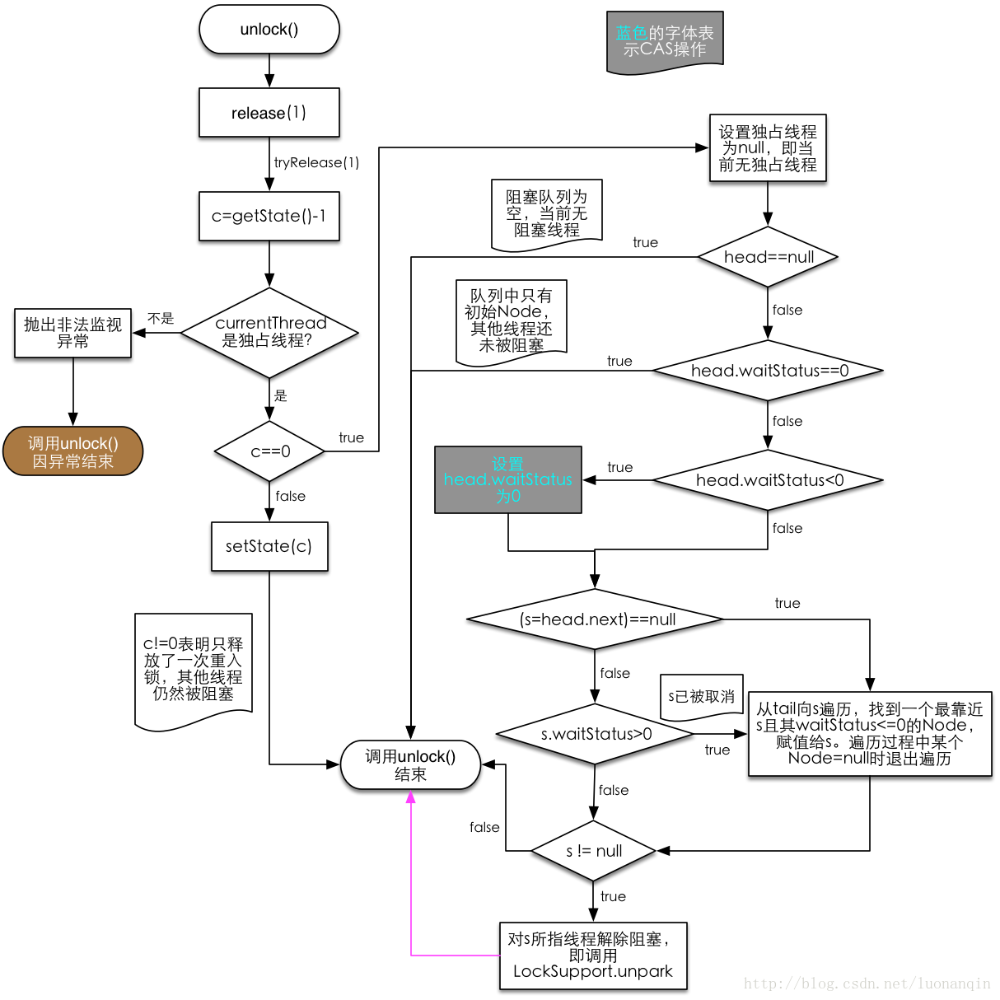

# 线程/进程

- 进程是系统分配资源的基本单位。
- 线程是系统调度的基本单位。

# 线程池/锁

## 线程池

### corePoolSize

线程池核心线程数量，核心线程不会被回收，即使没有任务执行，也会保持空闲状态。

### maximumPoolSize

池允许最大的线程数，当线程数量达到corePoolSize，且workQueue队列塞满任务了之后，继续创建线程。

### keepAliveTime

超过corePoolSize之后的“临时线程”的存活时间。

### unit

keepAliveTime的单位。

### workQueue

当前线程数超过corePoolSize时，新的任务会处在等待状态，并存在workQueue中，BlockingQueue是一个先进先出的阻塞式队列实现，底层实现会涉及Java并发的AQS机制。

①ArrayBlockingQueue

基于数组的有界阻塞队列，按FIFO排序。新任务进来后，会放到该队列的队尾，有界的数组可以防止资源耗尽问题。当线程池中线程数量达到corePoolSize后，再有新任务进来，则会将任务放入该队列的队尾，等待被调度。如果队列已经是满的，则创建一个新线程，如果线程数量已经达到maxPoolSize，则会执行拒绝策略。

②LinkedBlockingQuene

基于链表的无界阻塞队列（其实最大容量为Interger.MAX），按照FIFO排序。由于该队列的近似无界性，当线程池中线程数量达到corePoolSize后，再有新任务进来，会一直存入该队列，而不会去创建新线程直到maxPoolSize，因此使用该工作队列时，参数maxPoolSize其实是不起作用的。

③SynchronousQuene

一个不缓存任务的阻塞队列，生产者放入一个任务必须等到消费者取出这个任务。也就是说新任务进来时，不会缓存，而是直接被调度执行该任务，如果没有可用线程，则创建新线程，如果线程数量达到maxPoolSize，则执行拒绝策略。

④PriorityBlockingQueue

具有优先级的无界阻塞队列，优先级通过参数Comparator实现。

### threadFactory

创建线程的工厂类，通常我们会自定义一个threadFactory设置线程的名称，这样我们就可以知道线程是由哪个工厂类创建的，可以快速定位。

### handler

线程池执行拒绝策略，当线数量达到maximumPoolSize大小，并且workQueue也已经塞满了任务的情况下，线程池会调用handler拒绝策略来处理请求。

系统默认的拒绝策略有以下几种：

AbortPolicy：为线程池默认的拒绝策略，该策略直接抛异常处理。

DiscardPolicy：直接抛弃不处理。

DiscardOldestPolicy：丢弃队列中最老的任务。

CallerRunsPolicy：将任务分配给当前执行execute方法线程来处理。

我们还可以自定义拒绝策略，只需要实现RejectedExecutionHandler接口即可，友好的拒绝策略实现有如下：

将数据保存到数据，待系统空闲时再进行处理。

将数据用日志进行记录，后由人工处理。

## 锁-AQS

### ReentrantLock

head放在队列中有什么用处？为什么不是一个等待锁的线程作为head呢？原因很简单，因为每个等待线程都有可能被中断而取消，对于一个已经取消的线程，自然是有机会就把它gc了。那么gc前一定得让后续的Node成为head，**这样一来setHead的操作过于分散**，而且要应对多种线程状态的变化来设置head，这样就太麻烦了。所以这里很巧妙地将head的next设置为等待锁的Node，head就相当于一个引导的作用，因为head没有线程，所以不存在“取消”这种状态。



#### FairSync

- 公平锁lock方法调用acquire方法；

- 首先执行tryAcquire()方法，这个方法就是尝试获取资源；

  - 第一步获取到当前线程，得到当前资源的状态（state：0未加锁，1加锁）。

  - 如果state为0，执行hasQueuedPredecessors方法，返回false代表不需要排队，cas修改state，并获取资源，成功返回true。
    - 先判断是否需要排队，hasQueuedPredecessors方法，如果队列头尾相等，要么队列为空，要么无节点入队返回false;之后判断第一个等待节点中的线程和当前线程是否一致，一致会返回false,尝试获取资源.

  - 之后判断当前线程和占用资源线程是否一样，判断可重入锁的情况，成功返回true。

- 如果上一步返回false，代表获取资源失败，执行acquireQueued方法，开始尝试加入队列。

  - 先执行addWaiter方法，创建新节点（包含当前线程），把这个节点的prev指针指向前一个节点，cas设置当前节点为尾节点，如果成功直接返回新的尾节点。否则执行完enq方法返回新尾节点。
    - enq方法会先获取尾节点，并循环操作如下，如果尾节点为空，设置个空节点为head，continue。如果不为空，将有当前线程的节点和尾节点连通。
  - acquireQueued方法的入参为新的尾节点，会循环执行如下操作。
    - 先获得尾节点的前一个节点p。
    - 如果p为head，则尝试获取锁，如果成功了，断开和头节点连接并设置当前节点为头节点（当前节点的thread设为null），return false，
    - 之后会执行shouldParkAfterFailedAcquire方法，即把前一个等待节点的waitStatus设为-1（循环为了做这个事情），直到这个方法返回true，代表成功把前一个设置为-1；之后执行parkAndCheckInterrupt方法，把当前线程阻塞（如果被unlock方法唤醒，则继续并使acquireQueued返回true）。

[tryAcquire](#tryAcquire)

[addWaiter](#addWaiter)

[acquireQueued](#acquireQueued)

```java
//公平锁，lock方法
acquire(1);

//acquire方法
if (!tryAcquire(arg) &&
            acquireQueued(addWaiter(Node.EXCLUSIVE), arg))
            selfInterrupt();


```

##### tryAcquire

在公平锁的acquire方法中，tryAcquire()方法为试图获取锁，true为成功获取到了锁，false为未获取到锁

[hasQueuedPredecessors](#hasQueuedPredecessors)

```java
protected final boolean tryAcquire(int acquires) {

    //tryAcquire方法
    final Thread current = Thread.currentThread();
    int c = getState();//获得状态，0未加锁，1加锁
    if (c == 0) {
        if (!hasQueuedPredecessors() &&
            compareAndSetState(0, acquires)) {
            setExclusiveOwnerThread(current);
            return true;
        }
    }
    //可重入锁
    else if (current == getExclusiveOwnerThread()) {
        int nextc = c + acquires;
        if (nextc < 0)
            throw new Error("Maximum lock count exceeded");
        setState(nextc);
        return true;
    }
    return false;
}
```

[返回上一级FairSync](#FairSync)

##### hasQueuedPredecessors

返回值为true，不可以获取锁需要排队，返回值为false，可以尝试获取锁。

```java
Node t = tail; // Read fields in reverse initialization order
Node h = head;
Node s;
//如果h==t：
//	1.队列为空，可以尝试加锁。
//	2.队列不为空，但队列只有一个节点。
//如果h!=t，队列不止一个节点。
//(s=h.next)==null:
//	这种情况是为了排除有释放锁的情况，如果头节点的next为null，说明队列在h!=t后发生了变化，即首节点等到了锁释放，返回true，直接排队。
//s.thread != Thread.currentThread()
//	s为队列头的下一个节点，代表第一个等待的线程节点，如果当前线程与之相等，此字段为false,则代表可以尝试获取锁。
return h != t &&   
    ((s = h.next) == null || s.thread != Thread.currentThread());
```

[返回上一级tryAcquire](#tryAcquire)

##### addWaiter

[enq](#enq)

```java
private Node addWaiter(Node mode) {
    //mode=null
    Node node = new Node(Thread.currentThread(), mode);
    // Try the fast path of enq; backup to full enq on failure
    Node pred = tail;
    //如果尾节点为空，队列为空，逻辑在end方法中。
    if (pred != null) {
        node.prev = pred;
        //如果不为空，将此节点设置为尾节点，并连接在队列上。
        if (compareAndSetTail(pred, node)) {
            pred.next = node;
            return node;
        }
    }
    enq(node);
    return node;
}
```

[返回上一级FairSync](#FairSync)

##### enq

```java
private Node enq(final Node node) {
    for (;;) {
        Node t = tail;
        if (t == null) { // Must initialize
            //接上，如果队列为空，设置一个空的头节点，并将头，尾指向这个节点。
            if (compareAndSetHead(new Node()))
                tail = head;
        } else {
            //循环直到连接成功
            node.prev = t;
            if (compareAndSetTail(t, node)) {
                t.next = node;
                return t;
            }
        }
    }
}
```

[返回上一级addWaiter](#addWaiter)

##### acquireQueued

[shouldParkAfterFailedAcquire](#shouldParkAfterFailedAcquire)

返回值尾false，代表队列头直接加锁成功，返回true，代表被唤醒并执行成功。

```java
final boolean acquireQueued(final Node node, int arg) {
    boolean failed = true;
    try {
        boolean interrupted = false;
        for (;;) {
            //获得当前线程节点的前一个节点
            final Node p = node.predecessor();
            //如果前一个节点是头，尝试加锁
            if (p == head && tryAcquire(arg)) {
                //如果加锁成功，断前边的头，并把当前节点设置为头节点。
                setHead(node);
                p.next = null; // help GC
                failed = false;
                return interrupted;
            }
            if (shouldParkAfterFailedAcquire(p, node) &&
                parkAndCheckInterrupt())
                interrupted = true;
        }
    } finally {
        if (failed)
            cancelAcquire(node);
    }
}
```

[返回上一级FairSync](#FairSync)

##### shouldParkAfterFailedAcquire

aqs队列里边-1为挂起状态，每增加一个尾节点，都将前一个节点设置-1并挂起。

```java
private static boolean shouldParkAfterFailedAcquire(Node pred, Node node) {
    int ws = pred.waitStatus;
    if (ws == Node.SIGNAL)
        //ws==-1,前节点为-1，可以挂起
        /*
         * This node has already set status asking a release
         * to signal it, so it can safely park.
         */
        return true;
    if (ws > 0) {
        /*
         * Predecessor was cancelled. Skip over predecessors and
         * indicate retry.
         */
        //说明前边取消等待了，找到不取消的点。连接当前节点与最前边的点。
        do {
            node.prev = pred = pred.prev;
        } while (pred.waitStatus > 0);
        pred.next = node;
    } else {
        /*
         * waitStatus must be 0 or PROPAGATE.  Indicate that we
         * need a signal, but don't park yet.  Caller will need to
         * retry to make sure it cannot acquire before parking.
         */
        //将前一个节点的ws设置为-1，自己不能设置自己的状态
        compareAndSetWaitStatus(pred, ws, Node.SIGNAL);
    }
    return false;
}

///////////////////////
private final boolean parkAndCheckInterrupt() {
    //挂起当前线程
    LockSupport.park(this);
    return Thread.interrupted();
}
```

[返回上一级acquireQueued](#acquireQueued)

#### NonfairSync

```java
//lock方法内容，直接先尝试设置状态，设置失败执行acquire方法，即比公平锁多了个判断，失败执行和公平锁一样的操作。
if (compareAndSetState(0, 1))
    setExclusiveOwnerThread(Thread.currentThread());
else
    acquire(1);
```

#### unlock

ReentrantLock的unlock方法只有一个，是相同的。

```java
public void unlock() {
    sync.release(1);
}
```

```java
public final boolean release(int arg) {
    //尝试解锁
    if (tryRelease(arg)) {
        Node h = head;
        if (h != null && h.waitStatus != 0)
            unparkSuccessor(h);
        return true;
    }
    //false代表锁仍被持有，比如可重入锁。
    return false;
}

/****************************************/
    
protected final boolean tryRelease(int releases) {
    int c = getState() - releases;
    if (Thread.currentThread() != getExclusiveOwnerThread())
        throw new IllegalMonitorStateException();
    boolean free = false;
    if (c == 0) {
        //释放锁成功返回true，设置当前占用为null
        free = true;
        setExclusiveOwnerThread(null);
    }
    //如果c！=0，return false。
    setState(c);
    return free;
}
/******************************************/
//将头节点的ws设置为0;代表被唤醒，
private void unparkSuccessor(Node node) {
        /*
         * If status is negative (i.e., possibly needing signal) try
         * to clear in anticipation of signalling.  It is OK if this
         * fails or if status is changed by waiting thread.
         */
        int ws = node.waitStatus;
        if (ws < 0)
            compareAndSetWaitStatus(node, ws, 0);

        /*
         * Thread to unpark is held in successor, which is normally
         * just the next node.  But if cancelled or apparently null,
         * traverse backwards from tail to find the actual
         * non-cancelled successor.
         */
        Node s = node.next;
        if (s == null || s.waitStatus > 0) {
            s = null;
            
        //新节点pre指向tail，tail指向新节点，这里后继指向前驱的指针是由CAS操作保证线程安全的。而cas操作之后t.next=node之前，可能会有其他线程进来。所以出现了问题，从尾部向前遍历是一定能遍历到所有的节点。详看end中：
            /**
            else {
                //看这里
                node.prev = t;
                if (compareAndSetTail(t, node)) {
                    t.next = node;
                    return t;
                }
            **/
            for (Node t = tail; t != null && t != node; t = t.prev)
                if (t.waitStatus <= 0)
                    s = t;
        }
        if (s != null)
            LockSupport.unpark(s.thread);
    }

```

> An AbstractQueuedSynchronizer queue node contains a next link to its successor. But because there are no applicable techniques for lock-free atomic insertion of double-linked list nodes using compareAndSet, **this link is not atomically set as part of insertion**; it is simply assigned: pred.next = node; after the insertion. This is reflected in all usages. **The next link is treated only as an optimized path**. If a node's successor does not appear to exist (or appears to be cancelled) via its next field, it is always possible to start at the tail of the list and traverse backwards using the pred field to accurately check if there really is one.

# 锁升级

[彻底搞懂Java中的偏向锁,轻量级锁,重量级锁](https://www.itqiankun.com/article/bias-lightweight-synchronized-lock)


- CAS底层使用lock指令（cpu）：
- 确保对内存的读-改-写操作原子执行。在Pentium及Pentium之前的处理器中，带有lock前缀的指令在执行期间会锁住总线，使得其他处理器暂时无法通过总线访问内存。很显然，这会带来昂贵的开销。从Pentium 4，Intel Xeon及P6处理器开始，intel在原有总线锁的基础上做了一个很有意义的优化：如果要访问的内存区域（area of memory）在lock前缀指令执行期间已经在处理器内部的缓存中被锁定（即包含该内存区域的缓存行当前处于独占或已修改状态），并且该内存区域被完全包含在单个缓存行（cache line）中，那么处理器将直接执行该指令。由于在指令执行期间该缓存行会一直被锁定，其它处理器无法读/写该指令要访问的内存区域，因此能保证指令执行的原子性。这个操作过程叫做缓存锁定（cache locking），缓存锁定将大大降低lock前缀指令的执行开销，但是当多处理器之间的竞争程度很高或者指令访问的内存地址未对齐时，仍然会锁住总线。
    - 处理器自动保证基本内存操作的原子性：首先处理器会自动保证基本的内存操作的原子性。处理器保证从系统内存当中读取或者写入一个字节是原子的，意思是当一个处理器读取一个字节时，其他处理器不能访问这个字节的内存地址。奔腾6和最新的处理器能自动保证单处理器对同一个缓存行里进行16/32/64位的操作是原子的，但是复杂的内存操作处理器不能自动保证其原子性，比如跨总线宽度，跨多个缓存行，跨页表的访问。但是处理器提供总线锁定和缓存锁定两个机制来保证复杂内存操作的原子性。 
    - 使用总线锁保证原子性：第一个机制是通过总线锁保证原子性。如果多个处理器同时对共享变量进行读改写（i++就是经典的读改写操作）操作，那么共享变量就会被多个处理器同时进行操作，这样读改写操作就不是原子的，操作完之后共享变量的值会和期望的不一致，举个例子：如果i=1,我们进行两次i++操作，我们期望的结果是3，但是有可能结果是2。原因是有可能多个处理器同时从各自的缓存中读取变量i，分别进行加一操作，然后分别写入系统内存当中。那么想要保证读改写共享变量的操作是原子的，就必须保证CPU1读改写共享变量的时候，CPU2不能操作缓存了该共享变量内存地址的缓存。处理器使用总线锁就是来解决这个问题的。所谓总线锁就是使用处理器提供的一个LOCK＃信号，当一个处理器在总线上输出此信号时，其他处理器的请求将被阻塞住,那么该处理器可以独占使用共享内存。
    - 使用缓存锁保证原子性：第二个机制是通过缓存锁定保证原子性。在同一时刻我们只需保证对某个内存地址的操作是原子性即可，但总线锁定把CPU和内存之间通信锁住了，这使得锁定期间，其他处理器不能操作其他内存地址的数据，所以总线锁定的开销比较大，最近的处理器在某些场合下使用缓存锁定代替总线锁定来进行优化。频繁使用的内存会缓存在处理器的L1，L2和L3高速缓存里，那么原子操作就可以直接在处理器内部缓存中进行，并不需要声明总线锁，在奔腾6和最近的处理器中可以使用“缓存锁定”的方式来实现复杂的原子性。所谓“缓存锁定”就是如果缓存在处理器缓存行中内存区域在LOCK操作期间被锁定，当它执行锁操作回写内存时，处理器不在总线上声言LOCK＃信号，而是修改内部的内存地址，并允许它的缓存一致性机制来保证操作的原子性，因为缓存一致性机制会阻止同时修改被两个以上处理器缓存的内存区域数据，当其他处理器回写已被锁定的缓存行的数据时会起缓存行无效，在例1中，当CPU1修改缓存行中的i时使用缓存锁定，那么CPU2就不能同时缓存了i的缓存行。但是有两种情况下处理器不会使用缓存锁定。第一种情况是：当操作的数据不能被缓存在处理器内部，或操作的数据跨多个缓存行（cache line），则处理器会调用总线锁定。第二种情况是：有些处理器不支持缓存锁定。对于Inter486和奔腾处理器,就算锁定的内存区域在处理器的缓存行中也会调用总线锁定。
  - 禁止该指令与之前和之后的读和写指令重排序。
- 把写缓冲区中的所有数据刷新到内存中。
  - 总线锁、缓存锁、MESI：https://blog.csdn.net/qq_35642036/article/details/82801708
- 偏向锁：相当于贴个标签，没有锁竞争情况下效率高，不一定效率高，锁升级有消耗。
- 偏向锁默认打开，刚开始创建对象不是偏向锁，4s后创建空对象是偏向锁。
- JVM启动时会进行一系列的复杂活动，比如装载配置，系统类初始化等等。在这个过程中会使用大量synchronized关键字对对象加锁，且这些锁大多数都不是偏向锁。为了减少初始化时间，JVM默认延时加载偏向锁。这个延时的时间大概为4s左右，具体时间因机器而异。当然我们也可以设置JVM参数 -XX:BiasedLockingStartupDelay=0 来取消延时加载偏向锁。

## Java对象头

类型指针是指向该对象所属类对象的指针，mark word用于存储对象的HashCode、GC分代年龄、锁状态等信息。在32位系统上mark word长度为32bit，64位系统上长度为64bit。为了能在有限的空间里存储下更多的数据，其存储格式是不固定的，在32位系统上各状态的格式如下：


可以看到锁信息也是存在于对象的mark word中的。当对象状态为偏向锁（biasable）时，mark word存储的是偏向的线程ID；当状态为轻量级锁（lightweight locked）时，mark word存储的是指向线程栈中Lock Record的指针；当状态为重量级锁（inflated）时，为指向堆中的monitor对象的指针。

##  全局安全点（safepoint）

safepoint这个词我们在GC中经常会提到，简单来说就是其代表了一个状态，在该状态下所有线程都是暂停的。

## 偏向锁

### 偏向锁的过程

一个线程反复的去获取/释放一个锁，如果这个锁是轻量级锁或者重量级锁，不断的加解锁显然是没有必要的，造成了资源的浪费。于是引入了偏向锁，偏向锁在获取资源的时候会在资源对象上记录该对象是偏向该线程的，偏向锁并不会主动释放，这样每次偏向锁进入的时候都会判断改资源是否是偏向自己的，如果是偏向自己的则不需要进行额外的操作，直接可以进入同步操作。

（1）访问Mark Word中偏向锁标志位是否设置成1，锁标志位是否为01——确认为可偏向状态。
（2）如果为可偏向状态，则测试线程ID是否指向当前线程，如果是，进入步骤（5），否则进入步骤（3）。
（3）如果线程ID并未指向当前线程，则通过CAS操作竞争锁。如果竞争成功，则将Mark Word中线程ID设置为当前线程ID，然后执行（5）；如果竞争失败，执行（4）。
（4）如果CAS获取偏向锁失败，则表示有竞争。当到达全局安全点（safepoint）时获得偏向锁的线程被挂起，偏向锁升级为轻量级锁，然后被阻塞在安全点的线程继续往下执行同步代码。
（5）执行同步代码。

### 批量重偏向

当只有一个线程反复进入同步块时，偏向锁带来的性能开销基本可以忽略，但是当有其他线程尝试获得锁时，就需要等到safe point时将偏向锁撤销为无锁状态或升级为轻量级/重量级锁。这个过程是要消耗一定的成本的，所以如果说运行时的场景本身存在多线程竞争的，那偏向锁的存在不仅不能提高性能，而且会导致性能下降。因此，JVM中增加了一种批量重偏向/撤销的机制。

1.一个线程创建了大量对象并执行了初始的同步操作，之后在另一个线程中将这些对象作为锁进行之后的操作。这种case下，会导致大量的偏向锁撤销操作。

2.存在明显多线程竞争的场景下使用偏向锁是不合适的，例如生产者/消费者队列。

批量重偏向（bulk rebias）机制是为了解决第一种场景。批量撤销（bulk revoke）则是为了解决第二种场景。

其做法是：以class为单位，为每个class维护一个偏向锁撤销计数器，每一次该class的对象发生偏向撤销操作时，该计数器+1，当这个值达到重偏向阈值（默认20）时，JVM就认为该class的偏向锁有问题，因此会进行批量重偏向。每个class对象会有一个对应的`epoch`字段，每个处于偏向锁状态对象的`mark word中`也有该字段，其初始值为创建该对象时，class中的`epoch`的值。每次发生批量重偏向时，就将该值+1，同时遍历JVM中所有线程的栈，找到该class所有正处于加锁状态的偏向锁，将其`epoch`字段改为新值。下次获得锁时，发现当前对象的`epoch`值和class的`epoch`不相等，那就算当前已经偏向了其他线程，也不会执行撤销操作，而是直接通过CAS操作将其`mark word`的Thread Id 改成当前线程Id。

当达到重偏向阈值后，假设该class计数器继续增长，当其达到批量撤销的阈值后（默认40），JVM就认为该class的使用场景存在多线程竞争，会标记该class为不可偏向，之后，对于该class的锁，直接走轻量级锁的逻辑。

[盘一盘 synchronized （二）—— 偏向锁批量重偏向与批量撤销](https://www.cnblogs.com/LemonFive/p/11248248.html)

1. 批量重偏向和批量撤销是针对类的优化，和对象无关。

2. 偏向锁重偏向一次之后不可再次重偏向。

3. 当某个类已经触发批量撤销机制后，JVM会默认当前类产生了严重的问题，剥夺了该类的新实例对象使用偏向锁的权利

批量重偏向：当一个线程创建了大量对象并执行了初始的同步操作，后来另一个线程也来将这些对象作为锁对象进行操作，会导偏向锁重偏向的操作。

批量撤销：在多线程竞争剧烈的情况下，使用偏向锁将会降低效率，于是乎产生了批量撤销机制。

## 轻量级锁

（1）在代码进入同步块的时候，如果锁对象不是偏向模式或已经偏向其他线程，虚拟机首先将在当前线程的栈帧中建立一个名为锁记录（Lock Record）的空间，用于存储锁对象目前的Mark Word的拷贝。官方称之为 Displaced Mark Word（所以这里我们认为Lock Record和 Displaced Mark Word其实是同一个概念）。这时候线程堆栈与对象头的状态如图所示：


（2）拷贝对象头中的Mark Word复制到锁记录中。

（3）拷贝成功后，虚拟机将使用CAS操作尝试将对象头的Mark Word更新为指向Lock Record的指针，并将Lock record里的owner指针指向对象头的mark word。如果更新成功，则执行步骤（4），否则执行步骤（5）。

（4）如果这个更新动作成功了，那么这个线程就拥有了该对象的锁，并且对象Mark Word的锁标志位设置为“00”，即表示此对象处于轻量级锁定状态，这时候线程堆栈与对象头的状态如下所示：


（5）如果这个更新操作失败了，虚拟机首先会检查对象的Mark Word是否指向当前线程的栈帧，如果是就说明当前线程已经拥有了这个对象的锁，现在是重入状态，那么设置Lock Record第一部分（Displaced Mark Word）为null，起到了一个重入计数器的作用。下图为重入三次时的lock record示意图，左边为锁对象，右边为当前线程的栈帧，重入之后然后结束。接着就可以直接进入同步块继续执行。

如果不是说明这个锁对象已经被其他线程抢占了，说明此时有多个线程竞争锁，那么它就会自旋等待锁，一定次数后仍未获得锁对象，说明发生了竞争，需要膨胀为重量级锁。

### 轻量级解锁

（1）通过CAS操作尝试把线程中复制的Displaced Mark Word对象替换当前的Mark Word。

（2）如果替换成功，整个同步过程就完成了。

（3）如果替换失败，说明有其他线程尝试过获取该锁（此时锁已膨胀），那就要在释放锁的同时，唤醒被挂起的线程。

## 重量级锁

### 重量级锁加锁

1. 如果当前是无锁状态、锁重入、当前线程是之前持有轻量级锁的线程则进行简单操作后返回。
2. 先自旋尝试获得锁，这样做的目的是为了减少执行操作系统同步操作带来的开销
3. 调用`EnterI`方法获得锁或阻塞

一个`ObjectMonitor`对象包括这么几个关键字段：cxq（下图中的ContentionList），EntryList ，WaitSet，owner。

其中cxq ，EntryList ，WaitSet都是由ObjectWaiter的链表结构，owner指向持有锁的线程。


当一个线程尝试获得锁时，如果该锁已经被占用，则会将该线程封装成一个`ObjectWaiter`对象插入到cxq的队列的队首，然后调用`park`函数挂起当前线程。在linux系统上，`park`函数底层调用的是gclib库的`pthread_cond_wait`，JDK的`ReentrantLock`底层也是用该方法挂起线程的。

当线程释放锁时，会从cxq或EntryList中挑选一个线程唤醒，被选中的线程叫做`Heir presumptive`即假定继承人（应该是这样翻译），就是图中的`Ready Thread`，假定继承人被唤醒后会尝试获得锁，但`synchronized`是非公平的，所以假定继承人不一定能获得锁（这也是它叫"假定"继承人的原因）。

如果线程获得锁后调用`Object#wait`方法，则会将线程加入到WaitSet中，当被`Object#notify`唤醒后，会将线程从WaitSet移动到cxq或EntryList中去。需要注意的是，当调用一个锁对象的`wait`或`notify`方法时，**如当前锁的状态是偏向锁或轻量级锁则会先膨胀成重量级锁**。

### 重量级锁释放

如果EntryList为空，则将cxq中的元素按原有顺序插入到到EntryList，并唤醒第一个线程。也就是**当EntryList为空时，是后来的线程先获取锁**。这点JDK中的Lock机制是不一样的。

### futex

所有的futex同步操作都应该从用户空间开始，首先创建一个futex同步变量，也就是位于共享内存的一个整型计数器。

当 进程尝试持有锁或者要进入互斥区的时候，对futex执行"down"操作，即原子性的给futex同步变量减1。如果同步变量变为0，则没有竞争发生， 进程照常执行。如果同步变量是个负数，则意味着有竞争发生，需要调用futex系统调用的futex_wait操作休眠当前进程。

当进程释放锁或 者要离开互斥区的时候，对futex进行"up"操作，即原子性的给futex同步变量加1。如果同步变量由0变成1，则没有竞争发生，进程照常执行。如 果加之前同步变量是负数，则意味着有竞争发生，需要调用futex系统调用的futex_wake操作唤醒一个或者多个等待进程。

这里的原子性加减通常是用CAS(Compare and Swap)完成的，与平台相关。CAS的基本形式是：CAS(addr,old,new),当addr中存放的值等于old时，用new对其替换。在x86平台上有专门的一条指令来完成它: cmpxchg。

可见: futex是从用户态开始，由用户态和核心态协调完成的。